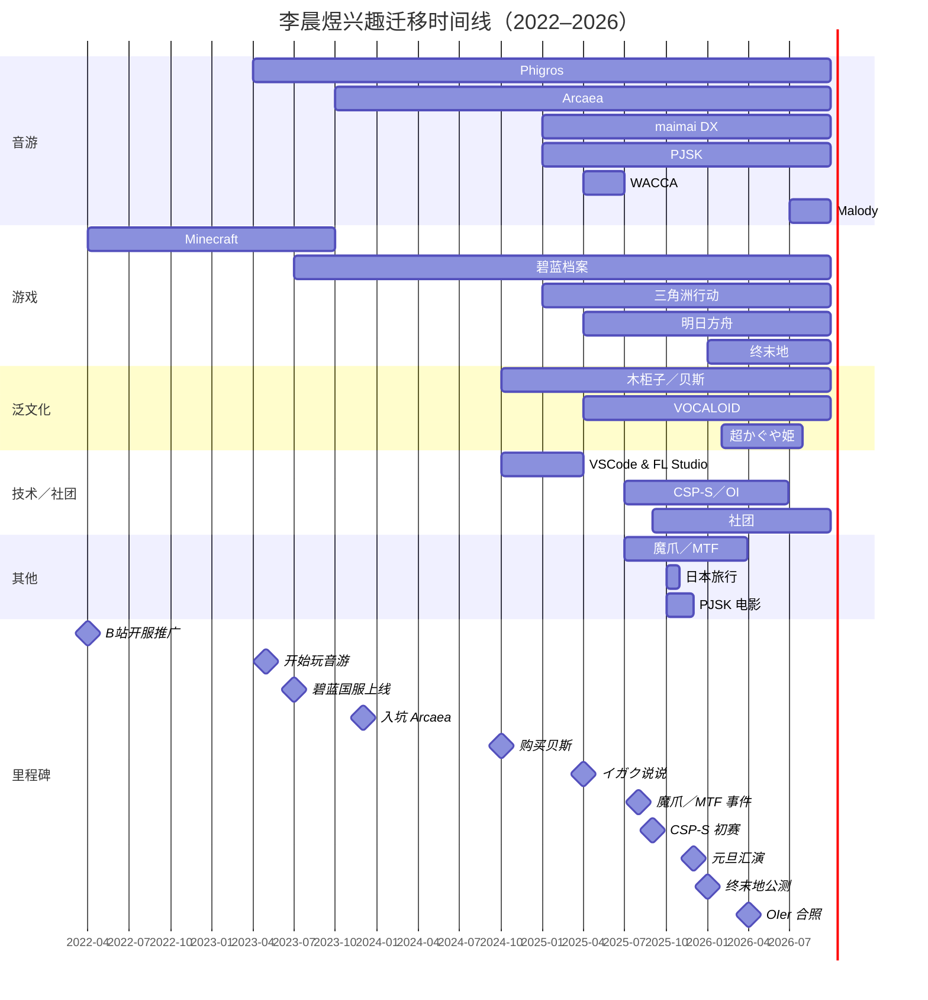

# 传奇人物志：李晨煜部分精选

2025年8月，作者一时兴起编写了围绕作者小学时期两位同学沈添翼、李晨煜的传奇人物志，一经刊载便在本人所处群体中广受传播。参见：[传奇人物志](/post/2025/08/LegendaryPerson.html)。

2026年9月28日19时48分，李晨煜在疑在桐乡市高级中学机房访问本人博客，并留下了三条评论（见下图）：


笔者特此在此公开于今年七月写成的**传奇人物志：李晨煜部分精选**。


:::info

本文中内容时效性强于传奇人物志。传奇人物志原文暂缓更新。该项目由 AI Agent 辅助协作，基于 $\LaTeX$ 进行排版制作。为方便SEO，下方文档通过PanDoc实现Tex2Markdown，可能出现内容失真与信息缺失。项目现已在[Github:Chinasd1st/LegendaryPersonsLatex](https://github.com/Chinasd1st/LegendaryPersonsLatex)上开源。

本文的[PDF版本（ghproxy镜像）下载链接](https://gh-proxy.com/https://github.com/Chinasd1st/LegendaryPersonsLatex/raw/master/LegendaryPerson.pdf)。

本文 Markdown 版本最后更新于2026年10月7日。
本文 $\LaTeX$ 版本最后更新于2026年7月29日。
文中数据采集时间若未特别标注，均为2026年7月。

:::

:::warning

AI Agent仅用于排版辅助与数据分析辅助。本人承诺本文正文内容均为人工编辑，并无借助Agent进行内容篡改。本人对文章信息真实性做担保。信源出处参见文中URL。

:::

[[toc]]

## 声明

### 基本信息

- Last updated: October 7, 2026

- 本文为作者基于个人回忆与公开可见信息的非正式记录，部分内容因时间久远无法完全保证准确性，请酌情阅读。为尊重隐私，本文不展示任何真人照片或可直接识别身份的敏感细节，所有姓名、账号等信息均来源于当时公开内容。如涉及当事人隐私或事实错误，欢迎联系作者更正或删除。本文为理性讨论与个人观点分享，非挂人或官方传记。文中部分内容涉及作者主观解读与回忆，仅代表作者个人观点，不代表客观事实。

- 若未特别注明，下方提及所有时间均为 UTC+8。

- 文章中的 “/” 符号指换行；==\[sic\]== 指 “原文如此”。

- 若有残缺部分，欢迎点击[在 GitHub 上编辑此页](https://github.com/Chinasd1st/Chinasd1st.github.io/edit/main/src/post/2025/08/LegendaryPerson.md)以扩充内容。

### 关于早期版本中“专题剖析”一节的说明

在2025年9月左右的初稿及后续几次迭代中，本文曾包含一节题为“专题剖析：年轻一代群体的独特心理”的内容。该节以李晨煜2024年11月23日的一条QQ空间说说为切入点，对沈添翼与李晨煜的部分行为模式进行了较为详细的解释性讨论，涉及虚拟主播订阅、音游社群参与、少女乐队内容消费方式、编程与音乐制作兴趣的短期计划等现象，并尝试置于特定亚文化生态与社群互动语境中进行观察。

经后续审视，作者已于2025年末至2026年初逐步移除该节全部内容，当前版本不再保留任何相关文字、段落或痕迹。主要考虑因素包括：

- 进一步强化对个人隐私与信息边界的保护；

- 避免因解释性讨论可能带来的误读、不适或争议；

- 保持全文以可验证的事实记录、时间线与公开证据为主的整体风格一致性。

现版本所呈现的内容已为经精简、调整与多次优化的最终形态。如对本文历史版本或相关背景有疑问，欢迎通过 GitHub Issues 与作者沟通。

2026年3月9日

## 个人相关信息与数据呈现

::: warning

知情人士称李晨煜有三个b站账号，下列内容可能不全面。

:::

李晨煜来自湖北孝感，他自诩为MC老萌新，平常喜欢混的圈子有：音游、木柜子乐队、碧蓝档案、泛VOCALOID等。以下是他的各平台账号：

| 平台 | 信息 |
| :--- | :--- |
| **洛谷** | Uninscription <https://www.luogu.com.cn/user/1468619> |
| **网易云音乐** | Uninscription <https://music.163.com/#/user/home?id=8947695497> |
| **哔哩哔哩** | 某只铭羽 <https://space.bilibili.com/1368216728>（曾用名：LiChenYu2010、LiCY无铭）；绝赞stars我一生之敌 <https://space.bilibili.com/3546742614132956> |
| **QQ** | 绝赞stars我一生之敌；3379377613 |
| **明日方舟** | 无铭#5064；ID 375623412 |
| **微信** | liii |
| **网易邮箱** | <tim635635@163.com> |

### 无向图展示李晨煜相关好友圈子信息

下图展示了李晨煜相关好友圈子联结信息，使用Gephi绘制。

该无向连通图采用节点着色映射顶点度大小，色度由红向蓝渐变对应顶点度单调递增。红色顶点云漠 DDDA、朱家辰、Ely_Twl 为低度顶点；浅黄、浅绿、棕色顶点为中度顶点；深蓝色顶点叶浩轩、冯圣杰、赵奕辉是图中度数最高的核心顶点。全图为单连通分支，任意两顶点间存在关联边，顶点间交互稠密。

<figure data-latex-placement="H">

<figcaption>无向图展示李晨煜相关好友圈子信息</figcaption>
</figure>

### 空间备份

2026年4月12日前后，李晨煜的QQ空间疑似开启了“访客仅能查看最近一年说说”的权限设置。为了防止相关信息再度灭失，本人对其近一年的QQ空间说说进行了备份。详见<https://silentnrtx.top/LCYBlogBak>

### 图表展示2023年8月以来李晨煜qq空间发帖涉及要素

下列图表展示了2023年8月以来李晨煜qq空间发帖所涉及的相关要素。

<div id="tab:lcypost">

| **月份** | **音游** | **贝斯** | **fps** | **技术** | **碧蓝档案** | **要素总和** | **发帖总数** |
| :--- | :--: | :--: | :--: | :--: | :--: | :--: | :--: |
| Aug-23 | 1 | 0 | 0 | 1 | 0 | 2 | 3 |
| Sep-23 | 0 | 0 | 0 | 0 | 1 | 1 | 1 |
| Oct-23 | 3 | 0 | 0 | 0 | 0 | 3 | 6 |
| Nov-23 | 4 | 0 | 0 | 0 | 0 | 4 | 7 |
| Dec-23 | 5 | 0 | 0 | 1 | 0 | 6 | 11 |
| Jan-24 | 3 | 0 | 0 | 1 | 0 | 4 | 9 |
| Feb-24 | 0 | 0 | 0 | 0 | 0 | 0 | 1 |
| Mar-24 | 3 | 0 | 0 | 0 | 1 | 4 | 4 |
| Apr-24 | 1 | 0 | 0 | 0 | 0 | 1 | 2 |
| May-24 | 0 | 0 | 0 | 0 | 0 | 0 | 0 |
| Jun-24 | 2 | 0 | 0 | 0 | 0 | 2 | 3 |
| Jul-24 | 1 | 0 | 0 | 0 | 0 | 1 | 1 |
| Aug-24 | 3 | 0 | 0 | 2 | 2 | 7 | 13 |
| Sep-24 | 1 | 0 | 0 | 0 | 0 | 1 | 1 |
| Oct-24 | 0 | 1 | 0 | 0 | 1 | 2 | 3 |
| Nov-24 | 2 | 0 | 0 | 2 | 1 | 5 | 9 |
| Dec-24 | 0 | 0 | 0 | 1 | 0 | 1 | 2 |
| Jan-25 | 2 | 0 | 0 | 0 | 0 | 2 | 3 |
| Feb-25 | 4 | 0 | 0 | 0 | 0 | 4 | 9 |
| Mar-25 | 3 | 0 | 1 | 0 | 1 | 5 | 9 |
| Apr-25 | 2 | 3 | 0 | 0 | 0 | 5 | 7 |
| May-25 | 5 | 3 | 0 | 1 | 0 | 9 | 11 |
| Jun-25 | 1 | 0 | 0 | 0 | 0 | 1 | 3 |
| Jul-25 | 5 | 0 | 0 | 1 | 1 | 7 | 22 |
| Aug-25 | 6 | 0 | 7 | 1 | 1 | 15 | 25 |
| Sep-25 | 1 | 0 | 0 | 3 | 0 | 4 | 4 |
| Oct-25 | 4 | 5 | 0 | 0 | 0 | 9 | 11 |
| Nov-25 | 8 | 2 | 0 | 0 | 0 | 10 | 11 |

李晨煜QQ空间发帖要素统计

</div>

我们不难发现，其音游发帖数量达78条，占所有“相关要素总和”的大部分。

### QQ空间说说情感分析与发帖时段分布

基于timeline.json备份数据（175条说说，2025年4月30日至2026年7月21日），使用SnowNLP对每条说说进行情感分析。SnowNLP返回值范围0–1，值越大越正面。设定阈值：正面\>0.6，负面\<0.4，中性为0.4–0.6。

#### 月度情感趋势

::: chartjs 李晨煜QQ空间月度情感均值趋势（2025.04–2026.07）
```json
{
  "type": "line",
  "data": {
    "labels": ["2025-04", "2025-05", "2025-06", "2025-07", "2025-08", "2025-09", "2025-10", "2025-11", "2025-12", "2026-01", "2026-02", "2026-03", "2026-04", "2026-05", "2026-06", "2026-07"],
    "datasets": [
      {
        "label": "情感均值",
        "data": [0.846, 0.498, 0.527, 0.502, 0.418, 0.675, 0.647, 0.527, 0.543, 0.445, 0.495, 0.432, 0.591, 0.917, 0.623, 0.477],
        "borderColor": "#3b82f6",
        "backgroundColor": "#3b82f6",
        "pointRadius": 3,
        "tension": 0.25
      },
      {
        "label": "正面阈值 0.6",
        "data": [0.6, 0.6, 0.6, 0.6, 0.6, 0.6, 0.6, 0.6, 0.6, 0.6, 0.6, 0.6, 0.6, 0.6, 0.6, 0.6],
        "borderColor": "#f59e0b",
        "borderDash": [6, 4],
        "borderWidth": 2,
        "pointRadius": 0
      }
    ]
  },
  "options": {
    "scales": {
      "y": { "min": 0.3, "max": 1.0, "title": { "display": true, "text": "情感均值" } },
      "x": { "title": { "display": true, "text": "月份（2025 年 4 月 – 2026 年 7 月）" } }
    }
  }
}
```
:::

<div id="tab:sentiment_monthly">

| **月份** | **均值** | **条数** | **正面率** |
|:---------|:--------:|:--------:|:----------:|
| 2025-04  |  0.846   |    1     |    100%    |
| 2025-05  |  0.498   |    10    |    20%     |
| 2025-06  |  0.527   |    3     |    33%     |
| 2025-07  |  0.502   |    20    |    35%     |
| 2025-08  |  0.418   |    22    |    32%     |
| 2025-09  |  0.675   |    3     |    67%     |
| 2025-10  |  0.647   |    11    |    45%     |
| 2025-11  |  0.527   |    11    |    45%     |
| 2025-12  |  0.543   |    7     |    57%     |
| 2026-01  |  0.445   |    9     |    33%     |
| 2026-02  |  0.495   |    19    |    37%     |
| 2026-03  |  0.432   |    4     |    25%     |
| 2026-04  |  0.591   |    8     |    38%     |
| 2026-05  |  0.917   |    4     |    100%    |
| 2026-06  |  0.623   |    9     |    56%     |
| 2026-07  |  0.477   |    24    |    33%     |

月度情感分析明细

</div>

175条说说中纯图片/空白6条已剔除，165条有效文本参与分析。总体均值0.521，正面65条（39%），负面63条（38%），中性37条（22%）。2025年5–8月及2026年1–3月、7月情感偏负面，与考试压力或情绪波动期吻合；2025年9月、2026年5–6月情感偏正面。

#### 发帖时段分布

::: chartjs 李晨煜QQ空间发帖时段分布（24小时）
```json
{
  "type": "bar",
  "data": {
    "labels": ["0", "1", "2", "3", "4", "5", "6", "7", "8", "9", "10", "11", "12", "13", "14", "15", "16", "17", "18", "19", "20", "21", "22", "23"],
    "datasets": [
      {
        "label": "发帖数量",
        "data": [1, 0, 0, 0, 0, 0, 0, 1, 2, 5, 2, 11, 12, 11, 6, 18, 17, 16, 24, 15, 13, 10, 8, 3],
        "backgroundColor": "#3b82f6"
      }
    ]
  },
  "options": {
    "plugins": { "legend": { "display": false } },
    "scales": {
      "y": { "min": 0, "max": 28, "title": { "display": true, "text": "发帖数量" } },
      "x": { "title": { "display": true, "text": "小时" } }
    }
  }
}
```
:::

高峰时段为18:00（24条，13.7%），其次为15:00–17:00（共51条，29.1%），与高中放学后自由时间吻合。凌晨0:00–7:00基本无发帖，符合学生作息规律。

#### 星期分布与假期对比

以实际校历划分：暑假2025年6月23日–8月18日、2026年7月6日起至今；寒假2026年2月7日–3月3日。

::: chartjs 学期中与假期星期发帖分布对比
```json
{
  "type": "bar",
  "data": {
    "labels": ["周一", "周二", "周三", "周四", "周五", "周六", "周日"],
    "datasets": [
      {
        "label": "学期中",
        "data": [4, 7, 11, 6, 6, 31, 25],
        "backgroundColor": "#3b82f6"
      },
      {
        "label": "假期",
        "data": [8, 13, 10, 12, 12, 20, 10],
        "backgroundColor": "#f59e0b"
      }
    ]
  },
  "options": {
    "scales": {
      "y": { "min": 0, "max": 35, "title": { "display": true, "text": "发帖数量" } },
      "x": { "title": { "display": true, "text": "星期" } }
    }
  }
}
```
:::

学期中90条说说，周末（周六+周日）占62%；假期85条说说，工作日占65%。学期中发帖高度集中于周末，假期则均匀分布于全周，符合在校生“平时住校、周末回家”的行为模式。

#### 发帖时段与星期热力图

<div class="heatmap-scroll">

<table class="heatmap">
  <caption>发帖时段与星期热力图（小时 × 星期，单元格为条数；范围 7–23 时，共 174 条）</caption>
  <thead>
    <tr><th scope="col">小时＼星期</th><th scope="col">周一</th><th scope="col">周二</th><th scope="col">周三</th><th scope="col">周四</th><th scope="col">周五</th><th scope="col">周六</th><th scope="col">周日</th></tr>
  </thead>
  <tbody>
    <tr><th scope="row">07:00</th><td class="hm-0">0</td><td class="hm-0">0</td><td class="hm-0">0</td><td class="hm-0">0</td><td class="hm-0">0</td><td class="hm-1">1</td><td class="hm-0">0</td></tr>
    <tr><th scope="row">08:00</th><td class="hm-0">0</td><td class="hm-0">0</td><td class="hm-0">0</td><td class="hm-0">0</td><td class="hm-1">1</td><td class="hm-0">0</td><td class="hm-1">1</td></tr>
    <tr><th scope="row">09:00</th><td class="hm-0">0</td><td class="hm-0">0</td><td class="hm-0">0</td><td class="hm-1">1</td><td class="hm-1">1</td><td class="hm-1">1</td><td class="hm-1">2</td></tr>
    <tr><th scope="row">10:00</th><td class="hm-0">0</td><td class="hm-0">0</td><td class="hm-1">1</td><td class="hm-0">0</td><td class="hm-1">1</td><td class="hm-0">0</td><td class="hm-0">0</td></tr>
    <tr><th scope="row">11:00</th><td class="hm-1">1</td><td class="hm-0">0</td><td class="hm-0">0</td><td class="hm-1">1</td><td class="hm-0">0</td><td class="hm-1">3</td><td class="hm-2">6</td></tr>
    <tr><th scope="row">12:00</th><td class="hm-1">1</td><td class="hm-0">0</td><td class="hm-0">0</td><td class="hm-1">3</td><td class="hm-1">2</td><td class="hm-1">1</td><td class="hm-2">5</td></tr>
    <tr><th scope="row">13:00</th><td class="hm-0">0</td><td class="hm-1">3</td><td class="hm-1">2</td><td class="hm-1">1</td><td class="hm-1">1</td><td class="hm-1">3</td><td class="hm-1">1</td></tr>
    <tr><th scope="row">14:00</th><td class="hm-0">0</td><td class="hm-0">0</td><td class="hm-0">0</td><td class="hm-1">1</td><td class="hm-0">0</td><td class="hm-1">1</td><td class="hm-2">4</td></tr>
    <tr><th scope="row">15:00</th><td class="hm-1">1</td><td class="hm-1">1</td><td class="hm-0">0</td><td class="hm-1">3</td><td class="hm-1">1</td><td class="hm-3">8</td><td class="hm-2">4</td></tr>
    <tr><th scope="row">16:00</th><td class="hm-1">3</td><td class="hm-1">1</td><td class="hm-1">1</td><td class="hm-0">0</td><td class="hm-1">2</td><td class="hm-2">6</td><td class="hm-2">4</td></tr>
    <tr><th scope="row">17:00</th><td class="hm-1">1</td><td class="hm-2">4</td><td class="hm-1">2</td><td class="hm-1">1</td><td class="hm-1">2</td><td class="hm-1">3</td><td class="hm-1">3</td></tr>
    <tr><th scope="row">18:00</th><td class="hm-1">1</td><td class="hm-1">1</td><td class="hm-1">2</td><td class="hm-1">2</td><td class="hm-1">3</td><td class="hm-4">12</td><td class="hm-1">3</td></tr>
    <tr><th scope="row">19:00</th><td class="hm-0">0</td><td class="hm-1">2</td><td class="hm-2">6</td><td class="hm-1">2</td><td class="hm-0">0</td><td class="hm-2">4</td><td class="hm-1">1</td></tr>
    <tr><th scope="row">20:00</th><td class="hm-1">3</td><td class="hm-1">2</td><td class="hm-1">1</td><td class="hm-1">2</td><td class="hm-1">2</td><td class="hm-1">2</td><td class="hm-1">1</td></tr>
    <tr><th scope="row">21:00</th><td class="hm-1">1</td><td class="hm-2">4</td><td class="hm-1">1</td><td class="hm-1">1</td><td class="hm-0">0</td><td class="hm-1">3</td><td class="hm-0">0</td></tr>
    <tr><th scope="row">22:00</th><td class="hm-0">0</td><td class="hm-1">1</td><td class="hm-1">1</td><td class="hm-0">0</td><td class="hm-1">2</td><td class="hm-2">4</td><td class="hm-0">0</td></tr>
    <tr><th scope="row">23:00</th><td class="hm-0">0</td><td class="hm-0">0</td><td class="hm-0">0</td><td class="hm-0">0</td><td class="hm-1">3</td><td class="hm-0">0</td><td class="hm-0">0</td></tr>
  </tbody>
</table>

</div>

热力图显示峰值为周六18:00（12条）。周六15:00–22:00为全周最活跃时段，工作日晚间（17:00–21:00）也有稳定发帖，但密度远低于周末。

#### 发帖设备月度变迁

::: chartjs 发帖设备月度变迁（堆叠）
```json
{
  "type": "bar",
  "data": {
    "labels": ["2025-04", "2025-05", "2025-06", "2025-07", "2025-08", "2025-09", "2025-10", "2025-11", "2025-12", "2026-01", "2026-02", "2026-03", "2026-04", "2026-05", "2026-06", "2026-07"],
    "datasets": [
      {
        "label": "5G",
        "data": [1, 7, 1, 6, 8, 3, 1, 4, 3, 2, 9, 0, 6, 0, 3, 16],
        "backgroundColor": "#3b82f6"
      },
      {
        "label": "4G",
        "data": [0, 1, 0, 6, 2, 0, 3, 0, 1, 0, 0, 1, 0, 0, 1, 1],
        "backgroundColor": "#ef4444"
      },
      {
        "label": "无标识",
        "data": [0, 3, 2, 10, 15, 0, 4, 5, 1, 4, 8, 2, 1, 0, 5, 5],
        "backgroundColor": "#22c55e"
      },
      {
        "label": "未知/其他",
        "data": [0, 0, 0, 0, 0, 0, 3, 2, 2, 3, 4, 1, 2, 4, 0, 2],
        "backgroundColor": "#9ca3af"
      }
    ]
  },
  "options": {
    "scales": {
      "y": { "min": 0, "max": 28, "stacked": true, "title": { "display": true, "text": "发帖数量" } },
      "x": { "stacked": true, "title": { "display": true, "text": "月份（2025 年 4 月 – 2026 年 7 月）" } }
    }
  }
}
```
:::

设备以荣耀X50i为主，网络模式标识在5G、4G与无标识间波动，可能反映不同地点（家中/学校/户外）的网络环境差异。2026年7月出现1条iPad发帖，为唯一非手机设备记录。

### B站默认收藏夹标签统计

以下数据基于李晨煜B站默认收藏夹（2025年6月22日至2026年2月7日，共5610条）的标签统计。完整Top 100列表见附录<a href="#app:bilibili_tags" data-reference-type="ref" data-reference="app:bilibili_tags">6</a>。

<div id="tab:bilibili_tags">

| **排名** | **标签**   | **数量** | **排名** | **标签**     | **数量** |
|:---------|:-----------|:---------|:---------|:-------------|:---------|
| 1        | 蔚蓝档案   | 1244     | 11       | FPS          | 282      |
| 2        | 碧蓝档案   | 804      | 12       | MMD          | 281      |
| 3        | 三角洲行动 | 528      | 13       | 娱乐         | 226      |
| 4        | 可爱       | 520      | 14       | 手书         | 222      |
| 5        | 二次元     | 510      | 15       | pjsk         | 221      |
| 6        | 搞笑       | 466      | 16       | BA           | 221      |
| 7        | 初音未来   | 460      | 17       | 世界计划     | 217      |
| 8        | 初音ミク   | 430      | 18       | 蔚蓝档案二创 | 217      |
| 9        | VOCALOID   | 320      | 19       | 明日方舟     | 206      |
| 10       | 必剪创作   | 304      | 20       | miku         | 201      |

B站收藏夹Top 20标签统计

</div>

::: note

标签存在重叠（如“蔚蓝档案”与“碧蓝档案”、“BA”指代同一游戏），实际合并后碧蓝档案相关标签总计约2486条。同理，“初音未来”与“初音ミク”、“miku”、“VOCALOID”存在交叉，合并后初音/VOCALOID相关约1411条。“三角洲行动”与“三角洲”、“FPS”、“射击游戏”等存在交叉，合并后FPS相关约1132条。

:::

#### 兴趣分布分析

基于上述标签统计，李晨煜的B站收藏夹兴趣分布可归纳为以下几大类：

<div id="tab:interest_categories">

| **兴趣类别**                     | **估算数量** |
|:---------------------------------|-------------:|
| 明日方舟（含终末地）             |         222+ |
| 碧蓝档案（合并计）               |         2486 |
| 初音未来/VOCALOID（合并计）      |         1411 |
| 音游（音乐游戏+pjsk+世界计划等） |         459+ |
| MMD/3D                           |          281 |
| FPS/三角洲行动（合并计）         |         1132 |

兴趣类别汇总

</div>

#### 与QQ空间发帖的对比

对比QQ空间发帖数据与B站收藏夹数据可以发现：

1. **明日方舟**在B站收藏夹中仅排第19位（206条，2.6%），但其QQ空间自2026年起频繁出现明日方舟内容，反映其在2026年兴趣重心的迁移。

2. **碧蓝档案**在收藏夹中占据绝对主导地位（合并后约2486条，31.6%），与其QQ空间2025年8月发帖中频繁出现碧蓝档案的趋势一致。

3. **初音未来/VOCALOID**在收藏夹中占比极高（合并后约1411条，17.9%），与其泛VOCALOID兴趣高度吻合。

4. **FPS/三角洲行动**在收藏夹中占比较高（合并后约1132条，14.4%），与其自称“天才少年”、频繁发布三角洲行动说说的行为相呼应。

### 李晨煜B站账号数据统计

<div id="tab:bilibili_stats">

| **时间**         | **粉丝** | **关注** | **获赞** |
|:-----------------|:--------:|:--------:|:--------:|
| 2022-10-29 00:25 |    8     |    –     |    –     |
| 2023-01-16 23:49 |    19    |    50    |    51    |
| 2023-04-20 22:09 |    22    |    54    |    54    |
| 2023-05-01 21:13 |    22    |    –     |    –     |
| 2023-07-25 01:21 |    23    |    –     |    –     |
| 2026-07-23 13:50 |    53    |   861    |   175    |

李晨煜B站账号数据统计

</div>

### B站直播间观看记录

以下数据基于李晨煜的直播间观看记录（截至2026年7月23日）。格式为**日期 · 主播 · 标题 · 直播时长 · （打赏金额）**。数据来源：<https://laplace.live/user/1368216728>

#### 2026年7月

**7月22日** · 千早澪Lynn · *3D麦COS* · 8h39m

- 00:03:50 进入直播间

- 00:22:21 进入直播间

**7月13日** · 立音的要塞都市 · *备战双周年的看号回* · 3h51m

- 12:13:54 进入直播间

- 12:19:42 吃井退坑了说是

- 12:20:38 吓哭了

**7月13日** · 随意Official · *程序员V 小白学习数据库 day7* · 2h53m

- 12:07:20 进入直播间

**7月12日** · literblack · *BW2026 Day3 游场直播* · 6h24m

- 12:09:41 进入直播间

#### 2026年6月

**6月18日** · 叉叉后知后觉 · *理论上来说撸十四年了……* · 1h4m

- 20:55:34 进入直播间

**6月8日** · 冉酱今天怎么样_ask · *【网吧】也没人跟我说考核要女装啊！* · 2h25m

- 14:05:35 进入直播间

#### 2026年2月

**2月25日** · 猫野酱Nedo · *为了榜一穿死库水* · 3h40m

- 08:44:45 进入直播间

**2月16日** · 碧蓝档案资讯站 · *新年快乐！碧蓝档案新春会！* · 3h55m · 打赏¥0.2

- 20:16:54 我超！冰！🧊

- 20:27:33 小花花 ¥0.1

- 20:46:15 除夕快乐！

- 20:53:36 ？

- 22:37:10 小花花 ¥0.1

- 22:38:18 ？？

- 22:39:36 ？

- 23:09:45 进入直播间

- 23:22:03 神秘的东方歌曲

- 23:22:30 朋友的情谊呀比天还高比地还辽阔～

- 23:53:56 新年快乐！

### 网易云音乐听歌分析

以下数据基于李晨煜网易云音乐听歌记录（共100首，截至2026年7月22日），数据来源为Github项目NeteaseCloudMusicApiEnhanced/api-enhanced（<https://github.com/neteasecloudmusicapienhanced/api-enhanced>）。部署方法参考<https://silentnrtx.top/post/2026/06/LichenyuNeteaseMusicAnalysis.html>。完整100首列表见附录<a href="#app:netease" data-reference-type="ref" data-reference="app:netease">7</a>。

::: note

网易云音乐的外部API不向外界公开播放次数（playCount字段始终为0），因此无法直接获取精确的播放次数。下表中的“分数”字段为平台内部的听歌权重/偏好分（29–100），分数越高代表该歌曲在李晨煜听歌画像中的权重越大。

:::

#### 听歌偏好总览

<div id="tab:netease_top20">

| **排名** | **歌曲**                          | **歌手**   |
|:---------|:----------------------------------|:-----------|
| 1        | DESTRUCTION 3,2,1                 | Supa7onyz  |
| 2        | Do you wanna kiss angel（中文版） | 龟娘       |
| 3        | Infinity Heaven                   | HyuN       |
| 4        | 雪降り、メリクリ                  | A-39       |
| 5        | NYA!!!                            | FLuoRiTe   |
| 6        | ジングルベル                      | A-39       |
| 7        | 光                                | 姜米條     |
| 8        | Dance with Silence                | かめりあ   |
| 9        | 游园地                            | 椒盐菠萝   |
| 10       | Spasmodic                         | 姜米條     |
| 11       | Distorted Fate                    | 削除       |
| 12       | 云女孩                            | 符白牙     |
| 13       | Igallta                           | Se-U-Ra    |
| 14       | Fracture Ray                      | 削除       |
| 15       | Phigros Theme                     | 姜米條     |
| 16       | Apocalyptic                       | Z ClaxX    |
| 17       | Miracle Forest (VIP Mix)          | Rinth      |
| 18       | プラリネ                          | かしこ。   |
| 19       | 聖夜讃歌                          | A-39       |
| 20       | Jumping23!                        | Shiroi-Ice |

网易云音乐听歌Top 20（按偏好分排序）

</div>

#### 偏好分分布

<div id="tab:netease_score_dist">

| **分数区间** | **歌曲数量** |
|:-------------|-------------:|
| 90–100       |            1 |
| 80–89        |            4 |
| 70–79        |            8 |
| 60–69        |            9 |
| 50–59        |            5 |
| 40–49        |           30 |
| 30–39        |           38 |
| 29以下       |            5 |

偏好分区间统计

</div>

100首歌曲偏好分总和为4634，平均46.3分。高分段（≥70）仅12首，说明李晨煜反复收听的歌曲集中在少数几首。

#### 兴趣画像

基于100首歌曲的分析，李晨煜的网易云音乐听歌偏好可归纳为以下几类：

1. **音游曲（核心偏好）**：以Phigros原创曲为主（DESTRUCTION 3,2,1、Infinity Heaven、Spasmodic、Igallta、Phigros Theme等），同时包含Arcaea（Fracture Ray）等音游曲目。偏好分最高的歌曲几乎全部为音游曲。

2. **蔚蓝档案OST**：アビドス高等学校対策委員会相关曲目5首（真昼の空の月、青春のアーカイブ等），与其B站收藏夹中蔚蓝档案标签数量（1244条）高度吻合。

3. **VOCALOID/UTAU**：初音ミク相关曲目多首（雪降りメリクリ、snooze、優等生等），与其泛VOCALOID兴趣一致。

4. **二次元翻唱**：泠鸢yousa等中文歌手。

#### 与B站收藏夹的对比

对比网易云音乐听歌记录与B站收藏夹数据：

1. **碧蓝档案**在B站收藏夹中占比最高（合并后约2486条），但在网易云音乐中仅出现5首OST，说明李晨煜对碧蓝档案的兴趣主要集中在视频（MMD、Momotalk）而非音乐。

2. **初音未来/VOCALOID**在两个平台上均占有一定比例，兴趣表现一致。

#### 喜欢音乐扩展分析（871首）

基于playlist.json（871首喜欢歌曲），对李晨煜的音乐偏好进行更大规模的分析。

##### 歌手分布

<div id="tab:playlist_artists">

| **歌手**                    | **歌曲数** |
|:----------------------------|-----------:|
| 初音ミク                    |        184 |
| 重音テト                    |         41 |
| 星海辰starsea               |         33 |
| ミツキヨ                    |         32 |
| DECO\*27                    |         31 |
| KARUT                       |         30 |
| 鏡音リン                    |         23 |
| 25時、ナイトコードで。      |         23 |
| 結束バンド                  |         23 |
| Nor                         |         22 |
| 可不                        |         19 |
| MIMI                        |         15 |
| ワンダーランズ×ショウタイム |         14 |
| ピノキオピー                |         14 |
| Vivid BAD SQUAD             |         13 |

喜欢音乐歌手Top 15

</div>

初音ミク以184首（21.1%）占据绝对主导，其次为重音テト（41首）和星海辰starsea（33首）。VOCALOID/虚拟歌手相关占据压倒性多数。

##### 专辑分布

碧蓝档案OST系列合计82首（占9.4%），为最大专辑来源：

- Vol.1（Longing for the Memorable Days）28首

- Vol.4（Aiming for the ideal freedom）18首

- Vol.3（Reaching for the precious time）17首

- Vol.2（Searching for the unknown truth）13首

- Vol.5（Striving for the bloomy festival）6首

##### 发行年份与总时长

::: chartjs 喜欢音乐发行年份分布（871 首）
```json
{
  "type": "bar",
  "data": {
    "labels": ["1989", "1990", "1991", "1992", "1993", "1994", "1995", "1996", "1997", "1998", "1999", "2000", "2001", "2002", "2003", "2004", "2005", "2006", "2007", "2008", "2009", "2010", "2011", "2012", "2013", "2014", "2015", "2016", "2017", "2018", "2019", "2020", "2021", "2022", "2023", "2024", "2025", "2026"],
    "datasets": [
      {
        "label": "歌曲数",
        "data": [1, 1, 0, 0, 0, 0, 1, 0, 0, 0, 0, 0, 0, 1, 0, 1, 0, 0, 6, 2, 2, 8, 2, 7, 12, 10, 8, 21, 19, 18, 22, 22, 46, 58, 69, 115, 81, 13],
        "backgroundColor": "#14b8a6"
      }
    ]
  },
  "options": {
    "plugins": { "legend": { "display": false } },
    "scales": {
      "y": { "min": 0, "max": 130, "title": { "display": true, "text": "歌曲数" } },
      "x": { "title": { "display": true, "text": "发行年份" } }
    }
  }
}
```
:::

总时长约45小时，平均单曲3.1分钟。2024年为发行高峰（115首），其次为2025年（81首）和2023年（69首），反映其偏好新发行歌曲。

## 传奇人物志：李晨煜

本章按时间顺序记录李晨煜的主要事迹，各时期兴趣的演变概览见附录<a href="#app:gantt" data-reference-type="ref" data-reference="app:gantt">5</a>。

### 小学时期相关轶事

#### 电子琴事件

小学时，李晨煜看到教室后方音乐老师的电子琴，声称自己会弹奏。然而当同学发给他一份五线谱（2023年12月31日）时，他却称不知道。随后有人问他会不会弹奏吉他，他表示自己也会。

### 身体状况

#### 红绿色盲

小学时，李晨煜向本人宣称其患有红绿色盲，需长期佩戴特殊眼镜。

#### 鼻衄

李晨煜常年有鼻衄（俗称“流鼻血”）症状。

### 音游

#### 音游圈子的乱象

音游圈子可能由于圈内玩家年龄较低，性格大多争强好胜，乱象频出。也不排除部分人将音游当做“时尚单品”的可能。

::: caution

针对以下内容，本文仅作现象描述，不提倡任何非法行为。

:::

部分圈外人，包括圈内人士认为，中早期音游圈子的乱象主要表现在小鬼众多、玩家素质较低、随意ky[^1]，现在已经发展为了网络黑产（开盒[^2]挂人）、圈内纷争、人身攻击等。同时也有圈外人士表示：音游圈子内阴阳怪气的语言表达方式让他不能接受，如“卖鶸”等。[^3]

2025年7月下旬，一用户在B站发布了一条视频，内容是使用男性外生殖器游玩Phigros这一音游，圈内人戏称“牛元”[^4]；视频发布后三小时左右即遭下架。这让部分人联系到7月“音游区直接过”的网络争议，同时这一事件在圈内外都造成了巨大的反响：不仅加深了圈外人对音游圈子的刻板印象（恶俗、低趣味），也暴露了音游圈子内部的混乱、恶臭与低龄化趋势。

#### QQ空间内的发言

##### 2023年

2023年5月起，李晨煜频繁发布、观看音游相关的视频，主要游玩**Phigros**等音游。2023年10月4日他在QQ空间提到：*“啊？PhiTogether更新了？！”*[^5]。同日，他在QQ空间发表一说说：“《关于我双指比多指打的好这件事》”，并附上了两张手机游戏PhiTogether的截图，这两张图分别展示了李晨煜游玩曲目*Clear morning*和*Tempestissimo*后的结算画面。[^6]随后，他又转发了一条QQ说说，展示了一张图片，写着*“觉得自己打音游很菜的转/（如果有大叠转了请缓缓打出一个‘？’）”*。

2023年11月4日，他发布一条说说，称*“phitogether又寄啦aaaaaaaaa”*；18日他发文*“极限辣（悲”*，并附图他游玩曲目**零號車輛**和**重生**后的结算画面。[^7]

2023年11月19日，他发布说说*“简述一下本人玩的几款游戏：Phigros是一款我的父亲蔚蓝档案是一款我的问题minecraft是一款我的世界awa”*。**蔚蓝档案是一款我的问题**这一说法可能来自手游BanG Dream!少女乐团派对全平台公测时在评论区中出现的一段圣经。[^8]

2023年12月2日0时58分，他在QQ空间说：*“因为在bili刷phigros天天看到所以我入坑arcaea力（喜”*，并配图了游戏**Arcaea**的截图，图中显示其用户名为*“LiceCY”*，ptt为0.00，同时拥有22个残片。**ptt**，即Potential，通常可译为潜力值，是用来客观衡量玩家游戏水平的数值。

一周后的12月9日的中午12时27分，他发布了一条qq空间说说，内容为*“《你游Login得挂梯》”*，这是由于游戏**Arcaea**在中国大陆并没有架设服务器。

一天后的12时49分，他在qq空间内发布了一条说说，附有一张图片，为其手机的应用安全检测界面，展示了几个他手机中的未知应用，分别为*“桐乡网校”* *“Phigros:Glaciaxion World”* *“Phira”* *“Phigros”* *“TapTap”* *“PhiTogether”*。[^9]

2023年12月30日上午9时47分，他在qq空间发布说说：*“我人麻了啊差点上白V尾数还666，关键排名250！”*[^10]。

当天的12时39分，他发文*“？”*，并配图音游**Phigros**中的提示，*“恭喜！你已经足够熟悉这款游戏了...”*当玩家在该游戏中到达一定水平时，游戏会自动解锁高难度谱面。

##### 2024年

来到2024年，彼时已经是1月26日，期末考试刚刚落下帷幕，李晨煜便在qq空间内发布*“aaaaa新支线没录到qwqwqwqwq（哭死）”*，次日12时10分，他又发布*“就应该好好学英语的。。。qwq”*，配图是国际服pjsk的开场，由于台词语言为英文，所以他发表这一言论。

28日中午12时24分，他发布*“冬天了，小心立秋qwq”*，配图是他在**Phigros**中游玩**ぱぴぷぴぷぴぱ**的截图，他取得了90.53%的acc，以及826122的score，最大连击数141。**立秋**是**ぱぴぷぴぷぴぱ**的曲作者。由于本曲的所有难度谱面均有大量Hold音符，难度较大，并且立秋这一曲师凭借其电波系的作曲风格令人印象深刻，便诞生“小心立秋”这一说法。然而，一些游戏玩家误以为这首曲目的歌手**ころねぽち**即为**立秋**，便不断在她本人的视频评论区下方发布各种与立秋相关的言论，这一ky现象在游戏圈子内外引起了不小的争议。

2024年3月24日，他发布说说*“艹（什”*，配图是四款游戏依照手游碧蓝档案LOGO风格生成的图标。这四款游戏分别为：**Milthm**、**Rizline**、**Phigros**、**Arcaea**。

> *本站也提供了这一生成器：*<https://silentnrtx.top/BA_logo/>

2024年4月26日，他发布说说*“阿卡伊和pgr联动了？！”*，展示了他游玩曲目**PRAGMATISM -RESURRECTION-**的结算画面。**PRAGMATISM**是由日本作曲家**Laur**创作的**Arcaea**原创曲。

两个月后的2024年6月16日，他发布说说*“两国源神开战了（群里截的图）”*[^11]，图片展示了一玩家在游玩**Arcaea**时游戏**Paradigm：Reboot**更新完毕后跳出弹窗使得游玩被打断的画面。**Paradigm: Reboot**是由中国游戏开发团队**TunerGames（击弦网络）**开发的一款音乐游戏。[^12]

2024年8月10日，他发表说说*“唉不是哥们......你这一天过得还不充实？知足吧你”*；并配图游戏碧蓝档案中的角色圣园未花。mai即**maimai DX**，是日本知名游戏娱乐厂商SEGA开发的街机音乐游戏。

##### 2025年

2025年2月8日12时57分，他发布说说*“唉你说我一个不会打乌蒙的上机练会不会占用龙币们珍贵的鸟+时间”*。[^13]

2025年2月15日，李晨煜发布说说*“孩子们，phi有AT17了”*，随后不久便发布*”孩子们，更新完我跌回新手村了”*。当日**Phigros**版本更新后定数大改，详见[^14]。

::: note

在Phigros中，所有常规曲目均具有“EZ”、“HD”、“IN”三种难度，部分曲目还具有额外难度“AT”。常规谱面等级范围为1 17级。

:::

2025年3月30日，李晨煜发布说说*“交互全打成双押了流速调快了哈气了”*，配图他游玩**Project Sekai: Colorful Stage**中**初音ミクの激唱**一曲目的画面。他达成了527657的score[^15]，有1346个perfect、148个great、10个good、4个bad和12个miss。李晨煜所提及的这种行为一般被称作馅蜜，馅蜜指在音乐游戏中将不同时的音符同时演奏的行为（多数情况下表现为交互当双押打）。一般用于混全连/混clear/总之各种只关注减少miss之类的判定不关注得分的场合。馅蜜手法有一定的糊的成分，但需要注意馅蜜≠糊。一般来讲，玩家在熟悉配置的情况下，知道了可以馅蜜或逆馅蜜的点，才会在特定情况下来使用馅蜜手法；但一般意义上的“糊”，是指不管音符如何出现，一律按照全押或乱拍的方法处理并相信按了所有的键的话，就一定有在判定区内的note被击中，相当于无脑乱蒙。[^16]

::: note

《世界计划 彩色舞台 feat. 初音未来》是由SEGA、Craft Egg、Crypton Future Media共同企划，SEGA Games与Craft Egg子公司Colorful Palette共同制作的一款音乐节奏类的社交手机卡牌网络游戏。简称“プロセカ”、“PRSK”、“PJSK（啤酒烧烤）”等。目前已发行繁体中文版、英文版、韩文版、简体中文版。国际版由SEGA直接营运，抖音集团旗下的朝夕光年负责营运所有日本以外的亚洲服务器。[^17]

:::

2025年4月5日，他发布说说“我去我爱越级”，配图游玩游戏**maimai DX**的图片，他游玩的是曲目**Cthugha**的**EXP**难度，定数为12+，达成率为90.3894%。画面中并未展现他的**Rating**。越级，一般指玩家游玩严重超出自己音游水平的谱面且获得较为不佳成绩的行为。**でらっくすRATING（DX Rating，DX评分）**与上文提到的rks、ptt相类似，是一种能够在一定程度上对玩家实力进行量化的数值。一个玩家的DX Rating是由过去版本常规谱面的DX Rating值中最高的35个，与当前版本常规谱面的DX Rating值中最高的15个相加组成。宴会场谱面不参与DX Rating的计算。[^18]

2025年5月3日，他发布说说*”鲨臂谁让你第一次上机就瞎调流速的”*，配图游玩街机音游**WACCA**的画面。图片中，他游玩了**Galaxy Friends**的**EXP**难度，定数12+，并取得了0866832的成绩。流速，即音符流动速度。改变音符流速不会改变实际的击打频率、动作，但是会改变音符的下落速度，过高或过低的速度都会显著增加读谱难度：若流速过低，则（在视觉上）音符密度显著上升，难以读谱；若流速过高，则难以反应。

::: note

**WACCA**是由**HARDCORE TANO\*C**主催，**Marvelous Inc**研发的一款街机音游。作为**HARDCORE TANO\*C**的旗下音游，主要收录由**HARDCORE TANO\*C**曲师所作的曲目，同时也收录BMS曲、东方Project同人曲、动漫OP/ED等版权曲目，收录曲曲风以HARDCORE为主。日版和国际版**WACCA Reverse**已于2022年9月1日0:00（UTC+9）起停止在线服务并离线化，离线后玩家将不可登录、保存游玩数据，部分曲目因版权期限也无法继续游玩。大陆版**《华卡音舞Ver.3.50》**于2023年8月13日结束更新，但保留联网登录等部分功能。[^19]

:::

2025年6月27日，他发布说说*”被拉出来打乌蒙冒出来5个问题:哎我草我粉怎么比金还多我准度呢我准度呢我准度呢星星到底怎么判的啊啊啊啊”*，配图是舞萌 \| 中二公众号，他进行了多次玩家二维码的获取。不同于maimai DX日服刷aime卡的登录方式，国内由华立科技代理的maimai DX使用二维码进行登录。金、粉分别指（CRITICAL）PERFECT和GREAT判定：对应最高判定和中间判定；星星，即SLIDE音符，通称“星星”，出现在屏幕上，包括SLIDE头部（记作TAP）与SLIDE TRACE两个部分。其中SLIDE头部通常为蓝色的五角星，与TAP的操作方式一致；在击打SLIDE头部一拍后，玩家需要按照引导在屏幕上沿着SLIDE TRACE的轨迹滑动，并尽量准确地在引导星星即将到达SLIDE TRACE结尾时完成整个SLIDE TRACE。[^18]

2025年8月14日19时11分，他发布说说：“我出勤把外套落机旁边了我刚想起来”。

2025年8月17日18时，他在qq空间发布说说：

> 复健失败\
> 于是流速+0.5然后抛弃大脑

[^21]

2025年8月26日16时57分，他发布说说“再越我是引诱旺”。七分钟后他又发布说说：

> “越紫12加两百多分唉”\
> “紫13和紫12应该差不多吧说不定加分还多”\
> “我打完了你告诉我这是紫13+？？？”\
> “再越我是勾”

::: note

maimai的常规谱面共有五个难度，分别为BASIC（初级）、ADVANCED（高级）、EXPERT（专家）、MASTER（大师）与Re:MASTER（宗师）难度（通常分别称为绿谱、黄谱、红谱、紫谱与白谱）。其中Re:MASTER难度是额外难度，仅部分乐曲具有，也可能后续单独进行Re:MASTER谱面的追加。除了难度名外，谱面也使用等级来表示谱面难度。目前maimai的谱面等级范围为1 15级，从7级开始会将一个数字区间分为两个等级，如7级与难度更高的7+级。越高的等级代表谱面游玩难度可能越高。[^18]

:::

##### 2026年

截至2026年7月18日，李晨煜仅发布了一条音游相关的说说（2026年3月7日）。该说说位于其空间备份站<https://silentnrtx.top/LCYBlogBak/2026/03/2026-03-07_15-46-43_cd356dc9e3d7.html>，内容如下：

> 之前忘发了的\
> 1《出完这一pc就下吧~》《？》\
> 2 😨\
> 3 咦！咦！咦！咦！唔！😋

2026年07月19日11:00:01他发布说说（<https://silentnrtx.top/LCYBlogBak/2026/07/2026-07-19_11-00-01_cd356dc9b13d.html>）：

> 666这个入开锁血了 （4dan通过，全掉叠上了，补习叠中）

“Dan”指的是音游Malody中评价玩家音游水平的段位分级。现行版本为Malody 4K Dan v3。详见视频*评论区常聊的“Dan”，究竟是什么？*（<https://www.bilibili.com/video/BV1QwQUY4EA9>）。下落式定轨音游中按照铺面键型可以分为叠（Jack）、技（Tech）、速（Speed）、切（Stream）。“叠”指的是同一时点多轨同时出现音符（Note）的键型。

2026年07月21日13:26:33他发布说说*“依旧出圈，我急眼”*（<https://silentnrtx.top/LCYBlogBak/2026/07/2026-07-21_13-26-33_cd356dc90903.html>）。

<figure data-latex-placement="htbp">

<figcaption>李晨煜和新疆入的交流</figcaption>
</figure>

#### QQ群中的发言

2023年12月17日，作者曾与李晨煜在小学班级群内有过交流：第二张图中的“meimei”，出自李晨煜本人空间内的转发视频，视频中展示了up主敲打乐器空灵鼓的画面，由于形似街机音游maimai DX他便配文“差点以为是meimei ==sic== ”，这一拙劣的错误令作者对其玩过maimai DX这一游戏的真实性产生怀疑。

<figure data-latex-placement="htbp">

<figcaption>班级群内长截图1</figcaption>
</figure>

<figure data-latex-placement="htbp">

<figcaption>班级群内长截图2</figcaption>
</figure>

2024年11月23日，李晨煜在作者胁迫下，向波尔多液配制交流群中发送了一张包含有他手机上所有音游的图片。

<figure id="fig:lichenyu_screenshot" data-latex-placement="htbp">

<figcaption>李晨煜在群内发送的图片</figcaption>
</figure>

### 木柜子

李晨煜最喜欢的木柜子乐队角色是来自2022年漫画改番剧《孤独摇滚！》中的山田凉，2024年10月，李晨煜购买了一把贝斯，发表在QQ空间的图片中我们还可看到山田凉这一角色的吧唧[^23]；2025年7月，李晨煜曾将微信头像改为山田凉，头像右下角还有未去除的小红书水印。但现在改为了碧蓝档案中会长这一角色。

在2025年7月4日时，本人在桐乡市高级中学2025级新生群中曾问询过李晨煜有没有玩过邦多利这款与少女乐队相关的音游，他回答没有，但这与李晨煜在2025年3月28日于qq空间中发布的说说相悖：原因是在这条说说中，李晨煜明确表示过自己玩过邦多利，但是他却回答没有，这不禁引人深思。此外，对近期李晨煜b站收藏夹标签的统计以及对其分布规律的发散探究（<https://silentnrtx.top/post/2025/07/LCYBilibiliFavoritesStatistics.html>）一文中，我们发现李晨煜至少收藏了13个BanG Dream!的相关视频，但是当我们向他问及“你最喜欢的BanG Dream!中的角色是谁”时，他却避而不谈。这种前后矛盾的态度，不禁让人好奇他对邦多利的真实看法。[^24]

<figure data-latex-placement="htbp">

<figcaption>说说截图</figcaption>
</figure>

> 第四行第四列的游戏为2024年暑期发售的《神椿市协奏中》，其UI设计和谱面风格导致这一款游戏极难读谱，作者并不认为李晨煜会购买并游玩这一粉丝向音游。

<figure data-latex-placement="htbp">

<figcaption>桐高新生群1</figcaption>
</figure>

<figure data-latex-placement="htbp">

<figcaption>桐高新生群2</figcaption>
</figure>

> 鸡，即Ave Mujica；狗，即MyGO!!!!! 。

#### 补番

李晨煜声称要在2026年暑假补完少女乐队番。

### 贝斯

贝斯这一乐器在器乐圈的定位十分尴尬：一方面，全球50%的人患有“听不见贝斯综合征”（手机外放等低频下潜不足），另一方面，随着近年来少女乐队企划的风靡，不少圈外人也热衷于购买类似乐器，导致其成为小众时尚单品。贝斯在这一语境中指代**Electric bass (guitar)**，而非爵士乐等中常见的**Double bass**（“bass”泛指低音乐器包括Double bass）。因此互联网上常见低音提琴的图片配文贝斯，这时一些“路人”就会不明觉厉地发送“《贝斯》”等评论或弹幕，实在令人忍俊不禁。此外，贝斯这一乐器的整体频率较低，而人耳对低频的敏感度不及高频，导致bass在乐曲中几乎没有存在感，除非使用一些特殊技法，如slap bass。

2025年国庆，李晨煜前往日本旅行。2025年10月1日 18:41他发布说说（<https://silentnrtx.top/LCYBlogBak/2025/10/2025-10-01_18-41-04_cd356dc94005.html>）：

> 哎我去我琴包怎么这么轻\
> 哦我知道了一定是每逢佳节贝斯轻\
> 唉我草我琴呢

2025年10月3日 15:15他发布说说*“？（琴店门口）”*（<https://silentnrtx.top/LCYBlogBak/2025/10/2025-10-03_15-15-48_cd356dc92478.html>），并配图他在一琴店门口拍摄的 Schecter Guitar Research 与 Ave Mujica 的联动海报。随即他又发文*”完蛋了我真看上了”*（<https://silentnrtx.top/LCYBlogBak/2025/10/2025-10-03_16-08-17_cd356dc97184.html>）。2025年4月24日，Schecter官方X（Twitter）宣布“Bang Dream! Ave Mujica Signature Model 商品化決定！” 8月28日正式公布细节，9月1日12:00起在日本SCHECTER JAPAN官网及授权店开启预购。详见<https://schecter.co.jp/collaboration/4432/>、<https://t.co/ixxsLSZFzJ>。

2025年10月05日 11:15:59，李晨煜发布说说（<https://silentnrtx.top/LCYBlogBak/2025/10/2025-10-05_11-15-59_cd356dc9efe2.html>）：

> 袜贝斯中心 袜去你谁

配图中有*“Bass Center”*字样。图二中展现了其中堆放了大量的Double Bass。可见李晨煜将“Bass”误认为是电贝斯。

2025年11月15日，李晨煜发布说说：“其实剪不断理还乱的不一定是离愁”（<https://silentnrtx.top/LCYBlogBak/2025/11/2025-11-15_21-39-10_cd356dc97e82.html>），配图中，李晨煜的房间内放置有效果器和音响。图中的效果器在10月5日中的说说中曾出现过（<https://silentnrtx.top/LCYBlogBak/2025/10/2025-10-05_17-21-15_cd356dc98b38.html>），图片上显示 Analog Optical Compressor，型号为 Ampeg 的 Opto Comp，是一套光电压缩器模块。面板上只有三个旋钮：Compression、Release 和 Output Level，底板内部带有 -15 dB PAD 跳线，售价在100–130美元左右[^25]。光学压缩器使用 LED + 光敏元件作为控制电路，响应不是瞬间的，因此可以产生平滑的音量控制。[^26]音响方面，李晨煜使用的是Hartke HyDrive系列音响，具体型号未知。

其好友表示，李晨煜曾专程前往日本，购买了一把贝斯，花费超过一万元人民币，品牌疑似为ESP。

**符号消费（Symbolic consumption）**是指个体购买和使用产品时，主要不是为了产品的实际功能效用，而是为了表达其身份、地位，或对某些群体的归属感的一种现象。[^27]

### 社团

2025年9月14日，桐高社团招新，李晨煜一口气报名了三个社团，分别是：光舞社、音乐社和动漫社。

#### 动漫社

动漫社招新后第一次会议的副社长选举换届环节，当提及谁要当副社长时，李晨煜成为了唯一举手的那个人，于是他便顺理成章地当上了副社长。然而据称动漫社此后每况愈下，原来的社长也因各种原因无法主持活动，社团几乎处于停摆状态。2026年4-5月左右，李晨煜作为决定召开会议以挽救动漫社，便广播了相关讯息，结果仅有一人到场。

2026年5月社团汇报（也被人戏称为“百团大战”），110班的同学想表演斗罗大陆话剧未通过初选，便用一块面包收买了社长，于是动漫社失去了表演名额，这让李晨煜很是气愤！

#### 光舞社、音乐社

2025年12月6日正值桐乡市高级中学元旦汇演，光舞社的社员们表演了**明日方舟危机合约净罪作战主题曲***Battleplan Extinguished Sins*（详见[【wota艺/明日方舟】我们把危机合约搬到了高中元旦晚会上](https://www.bilibili.com/video/BV1JR2QB8E6U/)）。

<figure data-latex-placement="htbp">

<figcaption>20251206元旦文艺汇演</figcaption>
</figure>

2025年12月，音乐社录制了**OneRepublic - Counting Stars**的MV，李晨煜出镜并演奏了贝斯。参见<https://www.bilibili.com/video/BV1xBmdBDEEp/>。

<figure data-latex-placement="htbp">

<figcaption>Counting Stars 录制场照，By WseNaoBran – CC BY-NC-ND 4.0</figcaption>
</figure>

### 魔爪、MTF与戊酸雌二醇

<figure data-latex-placement="htbp">

<figcaption>中文圈MtF群体社会分层与亚文化聚类简单研究</figcaption>
</figure>

不知从何时起，中文互联网常将魔爪饮料与跨性别群体构成联系。虽然这背后的历史渊源我们无从考证，但是显而易见地，魔爪饮料已经和MTF这一群体高度绑定，与编程、二次元等一并成为其象征标签。笔者一同学近日来每天都要喝下至少两罐魔爪，然而，中国大陆版魔爪明确标注：“饮用方法：开罐即饮，每日一罐，且不建议孕妇与14岁以下人士饮用，仅适合进行体育运动的人群饮用。”按照每罐93–100mg粗略估计，其每日咖啡因摄入量约为186–200mg。然而《中国居民膳食咖啡因摄入水平及其风险评估》指出，18岁以下未成年人的安全摄入量约为每天175毫克，其摄入量略超这一限额。这一现象敦促我们关注魔爪等功能性饮料出于各种文化原因无形间导致青少年群体咖啡因摄入超标的情况。[^28] [^29]

::: note

经查，外网上也有将魔爪与MTF关联的相关meme，然而讨论局限于这个“meme”本身，距离真正成为一个**身份认同**还相当遥远。详见<https://www.reddit.com/r/asktransgender/comments/1f6n8gt/why_are_different_monster_flavors_related_to_trans>。

:::

<figure data-latex-placement="htbp">

<figcaption>李晨煜在某群聊内的发言</figcaption>
</figure>

2026年2月25日，李晨煜在一群聊内让群友帮带魔爪；“wxh”即万象汇；值得注意的是，其头像疑似为拿着魔爪饮料的明日方舟中角色斯卡蒂。同时他的头像在互联网上没有找到任何可能的出处，Google相似图结果也非原始发布者，颇为神秘。

::: note

作者查看其头像大图后发现图中角色单手有六根手指，鉴定为AI生成图片；但是互联网上大量存在与之类似的搜索结果，我们却无法找到任何原作者生成这类图片的动机，令人生疑。

:::

值得注意的是，近年来简中互联网上有关性别的相关讨论愈演愈烈，将性别认同作为身份标签的现象也屡见不鲜。部分群体借此构筑亚文化高墙，其核心驱动力之一，便是寻求强烈的群体归属与身份认同，而非真正的“性别焦虑”。

2025年8月17日，李晨煜在群聊内发言，称其可以帮忙代购雌二醇，五百人民币一盒。经查，中国大陆线下购买单盒拜耳的雌二醇片价格在30–50元不等。其“报价”与普通渠道价差较大，一定程度上反映出其本人所处群体中的信息不对称性。[^30]

<figure data-latex-placement="htbp">

<figcaption>李晨煜在某群聊内的发言</figcaption>
</figure>

2026年3月4日李晨煜在群聊内发言：*“直接一板鱼板就行还做成汤圆真是太客气了”*。鱼板即（戊酸）雌二醇片，因其药物包装上图样形似鱼板而得名，原用于缓解更年期症状和其他雌激素不足的情况，近年来被MTF群体滥用，目的是改变其原有性征，成为所谓的药娘。MTF群体常在个人Profile中使用*🍥*这一Emoji来展示自己的性别认同。

<figure data-latex-placement="htbp">

<figcaption>李晨煜在某群聊内的发言</figcaption>
</figure>

### 碧蓝档案

李晨煜在b站最常收藏的视频就是碧蓝档案相关的内容[^31]。在上述提及的统计页面中，我们发现，李晨煜的含有“碧蓝档案”和“蔚蓝档案”的总收藏数达到了惊人的~~1258~~2048（2026年2月7日更新，未去重）。其中最常见的视频形式为MMD和Momotalk[^32]。

2023年暑期，碧蓝档案国服上线，随之迎来的是2024年4月的社区风波[^33]与2025年开始的“档蔚军”[^34]事件，这也展现了圈子不断扩大所带来的负面影响。如果读者对着一方面的内容感兴趣，作者可以开一篇专题来讲解这一乱象。李晨煜便是身处于此般社区纷争环境中的一员。李晨煜最早玩碧蓝档案的时间可以追溯到2023年7月左右，当时他在小学qq班级群中询问注册日服碧蓝档案账号，可以取什么名字。

2025年8月13日，他发布说说（<https://silentnrtx.top/LCYBlogBak/2025/08/2025-08-13_19-04-33_cd356dc94271.html>）：

> Na nananananana，\
> Na nananananana nananananana，\
> Na nananananana。\
> （哎我去国服怎么又写儿歌）\
> 哎我去国服写的儿歌怎么都这么洗脑）

### 明日方舟

2025年起（约为4月左右）李晨煜的b站收藏夹中开始出现明日方舟相关内容。

李晨煜的QQ空间自2026年起频繁出现明日方舟相关内容，截至2026年7月18日，短短五个月内他就已经直接或间接在QQ空间中提及明日方舟12次。2026年06月19日 22:45:23的说说（<https://silentnrtx.top/LCYBlogBak/2026/06/2026-06-19_22-45-23_cd356dc90356.html>）展示了他的明日方舟账号概览：玩家等级48级，共有108个干员，主线进度为15-5。

从图 <a href="#fig:lichenyu_screenshot" data-reference-type="ref" data-reference="fig:lichenyu_screenshot">3.1</a>中可以看出，李晨煜早在2024年10月就安装了明日方舟，但是，但2026年6月19日的说说显示其明日方舟账号注册于2026年4月26日。

### 泛VOCALOID

李晨煜除了上述几个圈子外，还对VOCALOID圈子有涉猎。他最喜欢的歌姬有：重音Teto、初音Miku等。泛VOCALOID社群同样以年轻用户为主，存在与音游圈类似的圈层现象。

#### イガク

2025年4月5日12时56分，他发布说说：“ユ!”，配图来自p主原口沙輔创作的UTAU曲目イガク中的画面。[^35]

#### 死別

2025年10月12日 12:47:53，他发布说说：

> （边午睡边听歌） （惊醒）

配图为日本术力口Pシャノン创作的歌曲死別。

#### wowaka

wowaka（日语：ヲワカ，1987年11月4日—2019年4月5日），或称作现实逃避P（日语：現実逃避P），日本音乐创作家，hitorie乐队首任主唱兼吉他手。2019年4月5日因急性心脏衰竭去世，享年31岁[^36]。无论是在李晨煜的b站收藏夹还是QQ空间中，乃至微信朋友圈，都出现了悼念wowaka的内容。详见李晨煜2026年1月朋友圈。

#### PJSK电影

上文中我们提到了李晨煜是一个PJSK玩家，2025年10月25日，世界计划：无法歌唱的初音未来（劇場版プロジェクトセカイ 壊れたセカイと歌えないミク）在中国大陆上映。李晨煜于2025年10月26日观看了这一电影，随后分别于2025年10月26日 12:34:04（<https://silentnrtx.top/LCYBlogBak/2025/10/2025-10-26_12-34-04_cd356dc9bca4.html>）、2025年10月26日 15:01:06（<https://silentnrtx.top/LCYBlogBak/2025/10/2025-10-26_15-01-06_cd356dc932c7.html>）、2025年11月02日 09:51:15（<https://silentnrtx.top/LCYBlogBak/2025/11/2025-11-02_09-51-15_cd356dc913b9.html>）、2025年11月02日 14:17:13（<https://silentnrtx.top/LCYBlogBak/2025/11/2025-11-02_14-17-13_cd356dc969f7.html>）、2025年11月02日 14:17:48（<https://silentnrtx.top/LCYBlogBak/2025/11/2025-11-02_14-17-48_cd356dc98cf7.html>）、2025年11月02日 16:39:16（<https://silentnrtx.top/LCYBlogBak/2025/11/2025-11-02_16-39-16_cd356dc9b418.html>）连续发布了六条QQ空间说说。这令人忍俊不禁。

### 技术

#### 调试失败

2024年11月16日17时02分，他发布说说“丸辣”，并配图Visual Studio Code的弹窗图片，上面显示：

> Unable to start debugging. Program path\
> ‘D:\Codes\LuoGu/T528356 \[入门赛A\].exe’ is missing or invalid.\
> \
> GDB failed with message: D:\Codes\LuoGu/T528356 \[入门赛 A\].exe: No such file or directory.\
> \
> This may occur if the process’s executable was changed after the process was started, such as when installing an update. Try re-launching the application or restarting the machine.

由路径名称我们可以推断出这是洛谷的竞赛题。

此外从图中可以看出几个问题：

1. 路径格式冲突：混用反斜杠和正斜杠。Windows系统通常使用反斜杠（`\`）作为路径分隔符，而GDB（源于Unix工具链）可能对路径格式敏感，尤其是混用分隔符时会导致解析失败。

2. 路径中包含中文、空格和特殊字符：文件名包含空格（`[入门赛 A]`）和方括号（`[]`）。

#### 学习VSCode和FL Studio

2025年2月22日11时45分，他发布说说：

> 八辈子没开过VSC和FL了\
> 说好的寒假好好学一下呢（）

VSC，指Visual Studio Code，是微软开发的免费开源跨平台代码编辑器，支持多种编程语言，具有智能代码补全、调试、版本控制等功能，通过丰富的扩展生态可进一步增强其性能，界面可定制，深受开发者喜爱。[^37]FL，即FL Studio，是由 Image Line BVBA（现已变更为Image Line Software NV，比利时2019年公司法改革后，所有 BVBA 必须转为 BV（封闭式）或 NV（开放式））开发的音乐制作软件，也被称为 “水果”。它是一款全能数字音乐工作站，支持编曲、剪辑、录音、混音等操作。

2025年11月16日16时整，他本人转发这条说说，配文：“翻空间，被回旋镖暴击，懊悔，但是继续打烤打完睡觉”。

#### 参加CSP-S

2025年08月27日 22:19:37，他发布说说（<https://silentnrtx.top/LCYBlogBak/2025/08/2025-08-27_22-19-37_cd356dc9fa13.html>）：

> 我来当炮灰了\
> 请输入文本

配图展示其CSP-S报名申请通过。CSP-J/S初赛（第一轮）考试时间为2025年9月20日。当天16:54:27，他发布QQ空间说说（<https://silentnrtx.top/LCYBlogBak/2025/09/2025-09-20_16-54-27_cd356dc9c36b.html>）：

> 没有雨，没有你，没有oi\
> （csp当天下雨）\
> luogu刷到的文突然就成暗示了😭😭😭补药啊我要打oi😭😭😭😭

这里“luogu刷到的文”指信息学平台洛谷上由kanlla发布的文章**没有雨，没有你，没有 OI**（<https://www.luogu.com.cn/article/lrawakq9>）

该文章虚构了一个女孩以梦境为框架，幻想另一条“if线”下自己未曾接触学业竞赛、彻底与暗恋对象错失交集的单恋故事。现实中，她只能以网友身份默默注视男孩公开恋爱，那句 “我喜欢你” 最终被删减成一句 “在吗”，发出去后如同石沉大海。男孩唯一一次主动联系她，竟是请她推荐成都纪念品送给自己的女友。她未说出口的爱意、错位的时空、清醒的遗憾交织一体，结尾反复叩问 “如果那天下着暴雨”、“如果你爱着我”，揭示这份感情既是一场无法触及的单恋，也是一场不愿醒来的自我欺骗之梦。文中反复出现 “原来一切都是一场梦”，最终以 “包括你爱过我” 收尾，将现实与幻想彻底撕开。

2025年09月30日 20:45:24李晨煜又发布说说，称*“做了一场oi的梦”*（<https://silentnrtx.top/LCYBlogBak/2025/09/2025-09-30_20-45-24_cd356dc9e4d0.html>）

2025年内，李晨煜未再发布任何OI相关说说，疑似在CSP-S初赛（第一轮）后未能晋级第二轮。

2026年，李晨煜再次参加CSP-S比赛。2026年9月19日，CSP-S第一轮于杭州师范大学举行。

#### 洛谷相关发言

下图截取于2026年7月18日。

<figure data-latex-placement="htbp">

<figcaption>李晨煜在洛谷上的发言</figcaption>
</figure>

#### OIer合照

<figure data-latex-placement="htbp">

<figcaption>李晨煜于2026年4月1日发布的桐高2028届OIer合照，参见<a href="https://silentnrtx.top/LCYBlogBak/2026/04/2026-04-05_17-59-47_cd356dc99332.html" class="uri">https://silentnrtx.top/LCYBlogBak/2026/04/2026-04-05_17-59-47_cd356dc99332.html</a></figcaption>
</figure>

### Minecraft

#### 引言

Minecraft是李晨煜本人最早混的圈子，但是由于众所周知的原因，这个圈子内早期鱼龙混杂，社群低龄化严重。

#### 开服

2022年4月4日18时01分，李晨煜在B站发布服务器推广内容，原文：

*emmmm······说出来你们可能不信，但我开服务器啦！（无正版验证）IP：jp-tyo-iij-1.natfrp.cloud：==\[sic\]== 26\*\*5（此处隐去端口号）挖红石和建筑大佬*

9月10日，作者在其专栏下方发表评论：“樱花的frp要一直开着的 而且这个日本的服务器不知道有没有被墙 还有，端口号的冒号用全角？”

在计算机科学中，NAT穿透（NAT traversal）涉及TCP/IP网络中的一个常见问题，即在处于使用了网络地址转换（NAT）设备的私有IP网络中的主机之间建立直接连接的问题。由于中国大陆互联网用户基数庞大且IPv4地址资源相对枯竭，互联网服务提供商（ISP）普遍通过部署运营商级NAT（Carrier-Grade NAT, CGNAT）技术，为大量用户（主机）共享同一个或少量公网IPv4地址，以缓解地址短缺压力。事实上，中国IPv4地址早已耗尽（APNIC早在2011年左右就无新IPv4可分配给中国ISP）。三大运营商（电信、联通、移动）几乎全面部署CGNAT，尤其在4G/5G移动宽带和部分光纤宽带上，使用100.64.0.0/10（RFC 6598共享地址空间）作为内层地址。这导致家用/个人用户极难获得独立公网IPv4，端口转发/自建服务器基本失效，除非申请昂贵的公网IP（或用IPv6，但IPv6普及仍有限）。frp等内网穿透工具利用客户端主动连接公网服务器建立反向隧道，巧妙地实现了外部请求的转发，从而成为在内网环境下搭建可访问服务器的有效且常用的解决方案。若frp客户端（frpc）或服务端（frps）任一进程停止，内网服务器与公网中继节点之间的反向代理隧道将立即断开。外部用户的所有请求将无法通过公网frps转发至内网，导致服务（如网站、远程桌面等）完全无法访问。frpc必须持续主动连接frps以保持隧道存活。一旦frpc进程关闭，内网设备将失去与公网frps的通信能力，外部请求即使到达frps也无法穿透至内网。frpc通常配置自动重连机制，但进程完全停止或网络长时间中断仍会导致服务中断。[^38]

URI/URL格式由国际标准（RFC 3986）明确定义，其中端口号前的分隔符必须为半角冒号（如 example.com:443）。全角冒号（：）或其他符号会被视为非法字符，导致解析失败。[^39]

李晨煜于2023年8月29日在空间内发布说说：“服务器开啦/ip: 127.0.0.1/无需正版/（红石生电+骗赞服）”。127.0.0.1即localhost，在计算机网络中，localhost是一个主机名称，指当前用于访问的计算机。localhost一名是为了环回目的而保留，它用于通过环回网络接口，访问本机运行的服务。使用环回接口会绕过任何物理网络接口硬件。[^40]也就是说，李晨煜实际上没有提供有效的ip地址，当玩家输入这一地址时，实际上是输入的本机地址，无法访问李晨煜的服务器。

#### 我有Dream好友

小学时李晨煜曾向好友称自己有Dream好友。

### 三角洲行动

2025年3月起，李晨煜的b站收藏夹中开始出现了与三角洲行动相关的视频。此外不乏CSGO等同类型游戏。同时李晨煜自称其获得了名为“天才少年”的游戏称号（李晨煜于2025年8月24日20时43分解锁该称号，参见<https://silentnrtx.top/LCYBlogBak/2025/08/2025-08-24_20-47-29_cd356dc9e109.html>），这一称号要求玩家于烽火模式机密难度以上任意地图单局击杀12人以上，或在全面战场中单局击杀140人以上。

::: note

三角洲行动是由腾讯开发的FPS游戏。最热门的游戏模式为“烽火模式”，强调玩家通过搜索物资、击杀敌人后撤离获取收益的过程（搜打撤），与“全面战场”的大规模混战玩法形成区分。

:::

### 其他

#### 明日方舟：终末地

《明日方舟：终末地》是由鹰角网络峘形山工作室开发的一款3D即时策略RPG，为《明日方舟》同IP游戏作品[^41]，于2026年1月22日11:00（UTC+8）全球公测。李晨煜在1月末至2月初曾短暂关注过该游戏。截至2026年2月7日，李晨煜b站默认收藏夹中含有标签“明日方舟终末地公测”的视频个数为16个，含有“明日方舟终末地”的视频个数为13个（两者可能重复出现）。1月31日13:27，李晨煜在qq空间发文“中，末地”，配图中写道“玩终末地上瘾的人是不是可以叫作末瘾人”。[^42]

#### 超かぐや姫！（超时空辉夜姬！）

《超时空辉夜姬！》（超かぐや姫！）是Studio Colorido与STUDIO CHROMATO制作的原创网络动画电影，于2026年1月22日由网飞独占上映，并有小说、漫画等衍生作品。[^43]2月14日开始，李晨煜的b站收藏夹开始出现相关内容。3月份开始便出现较少。

7月22日李晨煜点赞的视频中又出现了相关内容。（<https://www.bilibili.com/video/BV1tUKp68EiN>）

2026年07月26日 12:33:59李晨煜转发了电影中酒寄彩叶“钱……我要钱……（かっ金）”这一台词。

<figure data-latex-placement="htbp">

<figcaption>说说截图</figcaption>
</figure>

#### 有关于“病弱”的XP

如图：

<figure data-latex-placement="htbp">

<figcaption>李晨煜于2025年8月17日在某群聊内的发言</figcaption>
</figure>

## 李晨煜经典名言辑录与逻辑分析

### 声明

以下内容均为作者基于李晨煜在QQ空间、QQ群聊、B站等公开平台发布的言论进行的文本分析与意识形态解读，并且本文将仅局限于对其文本内容逻辑谬误的分析。所有引用均来源于公开可见的网络发言，分析仅代表作者个人观点，不构成对当事人人格的定性或评判。

### “我是正常人”；自怜与归咎于外

2026年04月25日 18:58:50

> 其实我一直会保持对每一个人的理解尊重，安慰和劝阻对方的不良情绪，直到我认为没必要了比如这种行为影响到我的生活为止\
> 我可不想我好不容易建立的正常人形象毁于一旦\
> 当然这里指的是一些因为被群体孤立而被我疏远的人，当然是在还不熟的情况下，特殊情况我会直接骂\
> 我们都是难以融入群体的人，互相理解一下吧\
> 以及\
> 其实这样的人根本不会出现在我的列表我只是发出来忏悔一下而已（）\
> 列里的各位都是我珍贵的朋友呢\
> 所以请多来冲冲这个可怜又寂寞的人的小窗吧qwq

#### 逻辑解读

“话语即权力”是法国哲学家米歇尔·福柯在其思想体系中提出的核心命题之一。这一命题强调话语并非单纯的语言表达或中性媒介，而是渗透于社会实践之中、无所不在的支配力量。福柯认为，话语通过生产、分配和调节“真理”的程序，被严格控制、选择、组织和再分配，从而形成社会规范与主体性。话语作为权力/知识的复合体，不仅塑造“合格”的社会个体，还通过规训机制（如观察、规范判断与考试）和生物权力作用于身体与人口，使权力内化为自我规训的技术。这种支配性力量无需持续的物理强制，即可役使社会实践主体，成为现代社会控制的核心机制。[^44] 李晨煜的逻辑可以概述为：*我很善良，我很正常，我偶尔不善良是因为对方有问题，我们“都是可怜人”所以要互相理解，所以你们要多来安慰我这个可怜人。*

这段文本声明要尊重每个人，随即把人排除在尊重之外；声称这样的人不会出现在自己的列表，却整段以他们为论述对象；把“难以融入群体”这一特征在自身身上当作需要被理解的处境，在他人身上却当作被疏远的正当理由，构成明显的双重标准。在这一语境下，“善良”“正常”的定义被彻底模糊化，什么是“正常”缺乏一个明晰的定义，这成为了其诡辩叙事的手段之一。在福柯看来，定义权是权力的核心形态。谁有权说“什么是正常”，谁就掌握了话语的制高点。李晨煜通过将“正常”保持为一个无需论证的预设前提，完成了对自身行为模式的自然化处理，也避免了对自身叙事逻辑的深思熟虑。此外*“其实我一直会保持对每一个人的理解尊重”*的绝对化表述也根本站不住脚。*“我们都是难以融入群体的人，互相理解一下吧”*直接把孤立个体群体叙事，实现对并无关系的“你我”之间的聚类化，试图拉进与读者或对方的距离以达到叙事合理化的目的，一旦读者认同“我也是可怜人”这一归属，便自动进入了李晨煜设定的话语框架，丧失了对该框架本身提出质疑的位置。无论从哪个视角来看这一发言都是十分青涩幼稚的。

### 被表白；骚扰小女孩

2026年04月25日 18:32:17

> 哦no我这么不近女色换来的居然是被给表白吗我没招了\
> 我将开始骚扰可爱小女孩

#### 逻辑解读

对“骚扰”“炼铜”这类词汇不分青红皂白的滥用暴露出了网络用语对李晨煜用语习惯的侵蚀。“骚扰”与“炼铜”在法律与伦理语境中指向的是真实的社会暴力与权力不对等，但李晨煜将其降格为一种自嘲式的、甚至可以博取圈内认同的“梗”。李晨煜对这类词汇的戏谑性演绎，实则反映了这些暴力词汇的内核在李晨煜所处的用语环境中已随互联网的娱乐化解构而被严重侵蚀。

### “受害者有罪论”

2026年5月下旬

666受害者有罪论都来了。

#### 逻辑解读

给批评者扣上“受害者有罪论”的帽子的最流氓之处就是短短几个字就可以推翻先前做出的所有有罪推断，我是“受害者”，那你就是“施暴者”，因此你做出的所有批评都是站不住脚的，本质上是一种拒绝沟通、逃避问题的手段。

## 兴趣迁移时间线

下图粗略展示了李晨煜各时期主要兴趣的演变过程。

<div id="app:gantt">

::: details 展开以查看详情，使用电脑端可获得最佳阅览体验



:::

</div>

## B站收藏夹标签完整统计

<div id="tab:bilibili_tags_full">

| 排名 | 标签 | 数量 |
| ---: | :--- | ---: |
| 1 | 蔚蓝档案 | 1244 |
| 2 | 碧蓝档案 | 804 |
| 3 | 三角洲行动 | 528 |
| 4 | 可爱 | 520 |
| 5 | 二次元 | 510 |
| 6 | 搞笑 | 466 |
| 7 | 初音未来 | 460 |
| 8 | 初音ミク | 430 |
| 9 | VOCALOID | 320 |
| 10 | 必剪创作 | 304 |
| 11 | FPS | 282 |
| 12 | MMD | 281 |
| 13 | 娱乐 | 226 |
| 14 | 手书 | 222 |
| 15 | pjsk | 221 |
| 16 | BA | 221 |
| 17 | 世界计划 | 217 |
| 18 | 蔚蓝档案二创 | 217 |
| 19 | 明日方舟 | 206 |
| 20 | miku | 201 |
| 21 | 三角洲 | 199 |
| 22 | 绘画 | 198 |
| 23 | 动画 | 180 |
| 24 | 明日方舟创作者应援计划 | 173 |
| 25 | 抽象 | 150 |
| 26 | 三角洲破壁新赛季上线 | 143 |
| 27 | 音乐 | 132 |
| 28 | 电子竞技 | 127 |
| 29 | ba | 126 |
| 30 | 沙雕 | 125 |
| 31 | 射击游戏 | 124 |
| 32 | 游戏 | 119 |
| 33 | 音乐游戏 | 118 |
| 34 | 术力口 | 115 |
| 35 | 剪辑 | 114 |
| 36 | 绘画过程 | 114 |
| 37 | 音游 | 113 |
| 38 | 原创 | 104 |
| 39 | 生活记录 | 104 |
| 40 | 三角洲行动7月激励计划 | 104 |
| 41 | 贝斯 | 102 |
| 42 | JOJO的奇妙冒险 | 102 |
| 43 | 爱丽丝 | 97 |
| 44 | 同人 | 97 |
| 45 | 动画种草激励计划 | 92 |
| 46 | 初音 | 92 |
| 47 | 整活 | 91 |
| 48 | meme | 88 |
| 49 | 3D | 87 |
| 50 | 二创 | 87 |
| 51 | 重音テト | 74 |
| 52 | 孤独摇滚 | 72 |
| 53 | 我的世界 | 72 |
| 54 | 推荐宝藏游戏 | 70 |
| 55 | Phigros | 65 |
| 56 | 初音未来：缤纷舞台 | 62 |
| 57 | 鬼畜 | 62 |
| 58 | mmd | 61 |
| 59 | DECO\*27 | 60 |
| 60 | 漫画 | 60 |
| 61 | 小鸟游星野 | 60 |
| 62 | 混剪 | 59 |
| 63 | 教程攻略 | 58 |
| 64 | 板绘 | 57 |
| 65 | 三角洲行动5月激励计划 | 56 |
| 66 | PJSK | 56 |
| 67 | MAD | 55 |
| 68 | 猛攻三角洲黑夜之子新赛季 | 55 |
| 69 | 画师激励计划 | 54 |
| 70 | 空崎日奈 | 54 |
| 71 | 碧蓝档案/蔚蓝档案 | 54 |
| 72 | 砂狼白子 | 54 |
| 73 | 动画短片 | 54 |
| 74 | cos | 52 |
| 75 | 明日方舟UP主应援计划 – 镜中集 | 51 |
| 76 | 第一视角 | 51 |
| 77 | 佳代子 | 51 |
| 78 | 25时 | 50 |
| 79 | 虚拟偶像 | 48 |
| 80 | 虚拟主播 | 48 |
| 81 | 三角洲欢乐剧场 | 48 |
| 82 | 壁纸 | 47 |
| 83 | 白子 | 45 |
| 84 | 日奈 | 45 |
| 85 | 手机游戏 | 44 |
| 86 | 东云绘名 | 44 |
| 87 | 舞蹈 | 43 |
| 88 | 圣园未花 | 42 |
| 89 | 重音teto | 42 |
| 90 | 早濑优香 | 42 |
| 91 | COVER | 41 |
| 92 | 配音 | 41 |
| 93 | 星野 | 40 |
| 94 | 晓山瑞希 | 85 |
| 95 | 记录 | 83 |
| 96 | Project SEKAI | 81 |
| 97 | 宵崎奏 | 80 |
| 98 | 治愈 | 79 |
| 99 | 高能 | 77 |
| 100 | MEME | 75 |

B站收藏夹标签统计（Top 100）

</div>

## 网易云音乐听歌完整记录

<div id="tab:netease_full">

| **排名** | **歌曲** | **歌手** | **偏好分** |
| ---: | :--- | :--- | ---: |
| 1 | DESTRUCTION 3,2,1 | Supa7onyz | 100 |
| 2 | Do you wanna kiss angel（中文版） | 龟娘 | 84 |
| 3 | Infinity Heaven | HyuN | 83 |
| 4 | 雪降り、メリクリ(feat.Miku) | A-39 | 83 |
| 5 | NYA!!! | FLuoRiTe | 81 |
| 6 | ジングルベル(Jingle bell) | A-39 | 77 |
| 7 | 光 | 姜米條 | 75 |
| 8 | Dance with Silence | かめりあ | 74 |
| 9 | 游园地 | 椒盐菠萝 | 72 |
| 10 | Spasmodic | 姜米條 | 72 |
| 11 | Distorted Fate | 削除 | 72 |
| 12 | 云女孩 | 符白牙 | 71 |
| 13 | Igallta | Se-U-Ra | 70 |
| 14 | 心灵的质量【我的三体-程心角色歌】（翻自 初音ミク） | 雲翼星辰 | 69 |
| 15 | Fracture Ray | 削除 | 68 |
| 16 | Phigros Theme | 姜米條 | 68 |
| 17 | Apocalyptic (Instrumental) | Z ClaxX | 68 |
| 18 | Miracle Forest (VIP Mix) | Rinth | 65 |
| 19 | プラリネ | かしこ。 | 62 |
| 20 | 聖夜讃歌(feat.初音ミク) | A-39 | 62 |
| 21 | Jumping23! | Shiroi-Ice | 61 |
| 22 | 望影の方舟Six | Se-U-Ra | 60 |
| 23 | cryout | Ju_E | 59 |
| 24 | 可爱补习法 | 泠鸢yousa | 58 |
| 25 | 優等生 (feat. 初音ミク) | Shino | 52 |
| 26 | 妄想哀歌 (feat. 初音ミク & 可不) | MIMI | 50 |
| 27 | 夜航星 (Night Voyager) | 蔡明希（不才） | 50 |
| 28 | RE Aoharu | Nor | 49 |
| 29 | Unwelcome school | ミツキヨ | 48 |
| 30 | 向着黎明奔去 (中文版) | 龟娘 | 47 |
| 31 | Luminescence | 米虾Fomiki | 47 |
| 32 | INFP.mp3 | TsukiP | 46 |
| 33 | Dreamland | CEM Records | 46 |
| 34 | 真昼の空の月 | アビドス高等学校対策委員会 | 45 |
| 35 | 青春のアーカイブ （TVsize） | アビドス高等学校対策委員会 | 45 |
| 36 | Another Me | D_AAN | 45 |
| 37 | 准备出发！ | 安雪璃 | 44 |
| 38 | Clear Morning(对策委员会) | Teenager19 | 44 |
| 39 | ストレイソウル・アラウンド (feat. 小春六花) | みーに | 44 |
| 40 | 万吨匿名信 | 闫东炜 | 44 |
| 41 | 希望の朝へ (向着黎明奔去) | 東山奈央 | 44 |
| 42 | Aurora VIP | Kirara Magic | 44 |
| 43 | 言いたいこと | 池年 | 43 |
| 44 | 雨女 | TsukiP | 43 |
| 45 | 开心病 | 闫东炜 | 43 |
| 46 | Inverted World | ARForest | 43 |
| 47 | 雨之城 | Castle城 | 43 |
| 48 | Crush BETA | shadow_bling | 43 |
| 49 | Phigros Result Theme Extended Mix | 姜米條 | 43 |
| 50 | 青空Magic Day | Sakula小舞 | 42 |
| 51 | Chronomia | Kankitsu | 42 |
| 52 | 青春のアーカイブ | アビドス高等学校対策委員会 | 41 |
| 53 | S.A.T.E.L.L.I.T.E. | かめりあ | 41 |
| 54 | Target for Love | 星海辰starsea | 41 |
| 55 | Floating Star | Kirara Magic | 41 |
| 56 | Skyscape | Plum - Melodic Artist | 41 |
| 57 | Memories of Kindness | 鹿乃 | 40 |
| 58 | 手つなぎハッピーエンド | 本渡楓 | 39 |
| 59 | Journey | Kirara Magic | 39 |
| 60 | Aoharu Band Arrange | ミツキヨ | 39 |
| 61 | Chronostasis | 黒皇帝 | 39 |
| 62 | 忍術研究部！只今参上！の巻。 | 水橋かおり | 38 |
| 63 | Ending | Nyarons | 38 |
| 64 | Believe Light (feat. 果丸哒呦) | Scaler | 38 |
| 65 | 真昼の空の月（TVsize） | アビドス高等学校対策委員会 | 37 |
| 66 | 雪降り  雪が降っている  | AiSS | 37 |
| 67 | Secret Garden（原曲by Jayn） | 停用账号37947 | 37 |
| 68 | Hello (BPM) 2024 | かめりあ | 37 |
| 69 | 澄んだ青空、萌ゆる心 | 上坂すみれ | 36 |
| 70 | あゆみ | 小倉唯 | 36 |
| 71 | Slow Down | Madnap | 36 |
| 72 | ありがとう、そしてこれからも | 星海辰starsea | 36 |
| 73 | 青空Magic Day | Sakula小舞 | 36 |
| 74 | His Theme | Toby Fox | 36 |
| 75 | Fractured Angel | DJ Raisei | 36 |
| 76 | 【Sugar Rush】「彩りキャンバス」 | 星海辰starsea | 35 |
| 77 | Aurora | Kankitsu | 35 |
| 78 | 想去海边 | 夏日入侵企画 | 34 |
| 79 | テレパシ | DECO\*27 | 34 |
| 80 | Temple | Zerky | 34 |
| 81 | 好きなんです! | 星海辰starsea | 32 |
| 82 | 一日一惡★レッツゴー！ | 近藤玲奈 | 32 |
| 83 | Do you wanna kiss angel（日文版） | 東山奈央 | 32 |
| 84 | 夢路の花 | 広橋涼 | 32 |
| 85 | JUMP！BEAT！PLAY！ | 苏枕袖 | 32 |
| 86 | El último baile | KθZyo | 32 |
| 87 | Hello (BPM) 2021 | かめりあ | 32 |
| 88 | 真昼の空の月（TVsize） | アビドス高等学校対策委員会 | 31 |
| 89 | Normal No More | TYSM | 31 |
| 90 | Luminous memory | ミツキヨ | 31 |
| 91 | snooze (feat. 初音ミク) | wotaku | 31 |
| 92 | ブルアカ-電脳-新春行進曲 | MasterScKaze7风 | 31 |
| 93 | 「カルバノグの兎」Theme 3 | 星ノ谷梓羽 | 30 |
| 94 | Time to Pretend | Lazer Boomerang | 30 |
| 95 | Rainy Heart | 阿卡姆巫师 | 30 |
| 96 | 花之舞 | CMJ | 29 |
| 97 | micro.wav | Dandeless | 29 |
| 98 | bye | DingerBox | 29 |
| 99 | TECHNOPOLIS 2085 | PRASTIK DANCEFLOOR | 29 |
| 100 | Retribution | Kry.exe | 29 |

网易云音乐听歌完整记录（100首）

</div>

## 网易云音乐喜欢音乐完整记录

<div id="tab:netease200_full">

| **排名** | **歌曲** | **歌手** | **专辑** | **时长** |
| ---: | :--- | :--- | :--- | ---: |
| 1 | ザムザ | てにをは, 初音ミク | ザムザ | 3:32 |
| 2 | IROHA’s Dancing All Night | Conisch | Cosmic Princess Kaguya! (Original Soundtrack) | 1:30 |
| 3 | 求&影 (feat. 重音テト) | ぴーなた, 重音テト | 求&影 (feat. 重音テト) | 3:56 |
| 4 | Break The Speakers | DJ Myosuke | Break The Speakers | 2:17 |
| 5 | 炉心融解 | iroha(sasaki), kuma, 鏡音リン | 初音ミク-Project DIVA- 2nd NONSTOP MIX COLLECTION | 5:28 |
| 6 | ネハン (feat. 重音テト) | 雄之助, 重音テト | ネハン | 3:33 |
| 7 | うみなおし | MARETU, 初音ミク | しう | 4:07 |
| 8 | グレイファインダー | 奈良瀬, 初音ミク | グレイファインダー | 2:31 |
| 9 | Oblivion: PHIN | Daily天利, EndCat-终猫, AiSS, 水东合电研 | Oblivion: PHIN | 3:06 |
| 10 | 証命讃歌 | MyGO!!!!! | 証命讃歌 | 3:12 |
| 11 | メルト | supercell, 初音ミク | メルト | 4:18 |
| 12 | おこちゃま戦争 | Giga, 鏡音リン, 鏡音レン | Download feat.初音ミク | 3:33 |
| 13 | キャンデー (feat. 鏡音リン) | r-906, 鏡音リン | キャンデー (feat. 鏡音リン) | 3:00 |
| 14 | 愛言葉 | DECO\*27, 初音ミク | DECO\*27 VOCALOID COLLECTION 2008～2012 | 4:24 |
| 15 | 宇宙散歩 | DECO\*27, 初音ミク | 宇宙散歩 | 2:36 |
| 16 | 最終鬼畜妹フランドール・Ｓ | ビートまりお | 東方ストライク | 3:25 |
| 17 | Koi is Love | ミツキヨ | Blue Archive Original Soundtrack Vol.2～Searching for the unknown truth～ | 1:48 |
| 18 | MTMTM (feat. Hatsune Miku) | TAK, 初音ミク | MTMTM (feat. Hatsune Miku) | 2:04 |
| 19 | 心予報 (feat. 花里みのり&桐谷遥&桃井愛莉&日野森雫&初音ミク) | MORE MORE JUMP！ | MORE MORE JUMP！ SEKAI ALBUM vol.2 | 3:21 |
| 20 | 黄昏ホログラム | 神様うさぎ, 初音ミク | 黄昏ホログラム | 3:14 |
| 21 | 月が綺麗ねと言われたい！ | 柿崎ユウタ | 月が綺麗ねと言われたい！ | 2:27 |
| 22 | ブレインロット | 東京真中, 重音テト | ブレインロット | 2:02 |
| 23 | 超深淵帯 | 稲葉曇, 歌愛ユキ | 超深淵帯 | 2:41 |
| 24 | ラストラス (feat. 初音ミク) | \*Luna, 初音ミク | 初音ミク「マジカルミライ 2025」OFFICIAL ALBUM | 4:30 |
| 25 | しんかいしょうじょ | 初音ミク, ゆうゆ | 初音ミク「マジカルミライ 2014」オフィシャルアルバム | 3:35 |
| 26 | ビっボ (Bi Bo) feat. 初音ミク | Magens | ビッボ (Bi Bo) | 2:34 |
| 27 | 系ぎて | Rintaro Soma | KOP5thオリジナルCD | 2:51 |
| 28 | flos | 初音ミク, R Sound Design | VOCALOID歌曲集 | 4:34 |
| 29 | 踊れオーケストラ (feat. 天馬司&鳳えむ&草薙寧々&神代類&巡音ルカ) | ワンダーランズ×ショウタイム | ワンダーランズ×ショウタイム SEKAI ALBUM vol.2 | 3:59 |
| 30 | アンテナ39 (feat. 初音ミク) | 柊マグネタイト, 初音ミク | 初音ミク「マジカルミライ 2024」OFFICIAL ALBUM | 3:08 |
| 31 | 恋愛サーキュレーション | 花澤香菜 | 恋愛サーキュレーション & あとがたり | 4:13 |
| 32 | マエガミスト | MARETU, 初音ミク | しう | 3:59 |
| 33 | 低彩度记事 feat. 初音未来 | Magens | 低彩度记事 | 3:23 |
| 34 | 愛言葉II | DECO\*27, 初音ミク | DECO\*27 VOCALOID COLLECTION 2008～2012 | 4:25 |
| 35 | 妄想税 | DECO\*27, 初音ミク | 妄想税 | 3:36 |
| 36 | 打上花火 | 米津玄師 | BOOTLEG | 4:19 |
| 37 | リアライズ (feat. 小豆沢こはね&白石杏&東雲彰人&青柳冬弥&初音ミク) | Vivid BAD SQUAD, 小豆沢こはね, 白石杏, 東雲彰人, 青柳冬弥, 初音ミク | リアライズ/CR詠ZY | 2:39 |
| 38 | 僕みたいな君 君みたいな僕 | DECO\*27, 初音ミク | 奏愛 -so i- | 4:32 |
| 39 | 愛言葉V | DECO\*27, 初音ミク | 愛言葉V | 3:39 |
| 40 | 我的悲伤是水做的 | ChiliChill乐团, 洛天依Official | 我的悲伤是水做的 | 3:45 |
| 41 | 猫と幸福論 (feat. 初音ミク&重音テト) | TakoyakiKZY, 初音ミク, 重音テト | 猫と幸福論 | 2:48 |
| 42 | ハローマリーナ | 稲葉曇, 歌愛ユキ, 初音ミク | ハローマリーナ | 3:21 |
| 43 | 毒占欲 | DECO\*27, 初音ミク | Conti New | 4:24 |
| 44 | Alice in a xxxxxxxx | 浅羽ロキ | Re:prosperitás | 2:35 |
| 45 | 混乱 Confusion | 回廊音乐 | 混乱 Confusion | 2:08 |
| 46 | チューニング | 夢限大みゅーたいぷ | チューニング | 3:16 |
| 47 | 携帯恋話 (feat. 東雲絵名&暁山瑞希&初音ミク) | まふまふ, 25時、ナイトコードで。, 初音ミク | 悔やむと書いてミライ/携帯恋話/ジャックポットサッドガール | 4:13 |
| 48 | DAYBREAK FRONTLINE | Orangestar, IA | SEASIDE SOLILOQUIES | 3:35 |
| 49 | Oshama Scramble! | t+pazolite | maimaiジューシー★おとりよせBOX | 2:03 |
| 50 | bornofnolightflicker | Silentroom | bornofnolightflicker | 2:17 |
| 51 | 怪物 | YOASOBI | 怪物 | 3:26 |
| 52 | αterlβus (2025 Remaster) | Aoi | αterlβus (2025 Remaster) | 2:01 |
| 53 | カーテンコール (feat. CONA) | CONA, 吐息 | カーテンコール (feat. CONA) | 2:21 |
| 54 | スポットレイト | 稲葉曇, 歌愛ユキ | スポットレイト | 3:03 |
| 55 | ぼくらの16bit戦争 (feat. GUMI) \[Remastered\] | sasakure.UK, GUMI | ぼくらの16bit戦争 (feat. GUMI) \[Remastered\] | 3:57 |
| 56 | シアンブルー (feat. 初音ミク) | ポリスピカデリー, 初音ミク | シアンブルー | 2:54 |
| 57 | キラピピ★キラピカ (feat. 天馬司&鳳えむ&草薙寧々&神代類&MEIKO) | ワンダーランズ×ショウタイム | キラピピ★キラピカ/フィラメントフィーバー | 3:48 |
| 58 | 生命性シンドロウム (feat. 初音ミク) | かめりあ, 初音ミク | 生命性シンドロウム | 3:50 |
| 59 | 桜樹街道 | Kozato snow | WAVEAT ReLIGHT Original Soundtrack | 2:48 |
| 60 | 又活了一天（哈基米版） | 庄东茹（豆芽鱼） | 又活了一天（哈基米版） | 2:33 |
| 61 | 舌尖上的哈基米 | 德华 | 舌尖上的哈基米 | 1:29 |
| 62 | ひやむぎ、そーめん、时々うどん | Foxtail-Grass Studio, ハム | 麺 | 4:26 |
| 63 | 曼波、那咩、有时哈基米 | akulamatata | 半减活暗暗 | 2:30 |
| 64 | Normal No More(哈基米) | 还给我神ID | Normal No More(哈基米) | 3:13 |
| 65 | 印度哈基米 | DJ大富豪 | 印度哈基米 | 2:06 |
| 66 | 打火机(哈基米版打火基) | 何水水 | 打火机(哈基米版打火基) | 1:59 |
| 67 | 不 得 不 哈 | 蜜了个甜梦 | 哈基米 | 1:49 |
| 68 | 悬疑哈基米 | 萌太俗 | 一起哈基米 | 0:26 |
| 69 | Wake Up Hajimi - 哈基米起床 | dollcatcher | Wake Up Hajimi - 哈基米起床 | 2:12 |
| 70 | 4nim0sity\|99.999999999%\| | イチ | 4nim0sity \[99.999999999%\] | 3:36 |
| 71 | ラグトレイン (feat. 宵崎奏&暁山瑞希&MEIKO) | 25時、ナイトコードで。 | 25時、ナイトコードで。 SEKAI ALBUM vol.3 | 4:13 |
| 72 | ギフト | DECO\*27, 初音ミク | MANNEQUIN | 2:47 |
| 73 | イイコと妖狐 | きくお, 绮萱 | イイコと妖狐 | 3:53 |
| 74 | ヤミナベ!!!! (feat. 初音ミク) | cosMo@暴走P, 初音ミク | ヤミナベ!!!! | 2:09 |
| 75 | alive | 市瀬るぽ, 鏡音リン | alive | 3:29 |
| 76 | 春を告げる | yama | 春を告げる | 3:16 |
| 77 | 我ら！ゴミ分別団 (feat. 重音テト & ずんだもん) | かてらざわ, 重音テト, ずんだもん | 我ら！ゴミ分別団 (feat. 重音テト & ずんだもん) | 2:17 |
| 78 | Voices (feat. 星乃一歌&天馬咲希&望月穂波&日野森志歩&鏡音リン) | Leo/need, 鏡音リン, ゆよゆっぺ | Voices/the WALL | 3:11 |
| 79 | 漸近線上の恋 (feat. 歌愛ユキ) | 愛猫コンストラクション, 歌愛ユキ | 漸近線上の恋 (feat. 歌愛ユキ) | 1:38 |
| 80 | すきなことだけでいいです | ピノキオピー, 初音ミク | HUMAN | 4:34 |
| 81 | QZKago Requiem | t+pazolite | maimai ALL PERFECT COLLECTiON 5 | 2:20 |
| 82 | 超最終鬼畜妹フランドール・S | COOL&CREATE | 超最強！最終鬼畜妹フランドール・S | 2:05 |
| 83 | 一千光年 | いよわ, 初音ミク, v flower, 歌愛ユキ, GUMI, VY1, 足立レイ, 可不, 星界, 裏命, 花隈千冬, SOLARIA | 一千光年 | 4:02 |
| 84 | 悔\_ | Essbee | 悔\_ | 2:40 |
| 85 | ループザルーム (feat. 初音ミク) | ルシノ, 初音ミク | ループザルーム / ランベントアリア | 2:14 |
| 86 | 天使の涙 (feat. 初音ミク) | MIMI, 初音ミク | 天使の涙 (feat. 初音ミク) | 2:35 |
| 87 | NIGHT DANCER | imase | NIGHT DANCER | 3:30 |
| 88 | Flyer! (feat. 小豆沢こはね&白石杏&東雲彰人&青柳冬弥&鏡音レン) | Vivid BAD SQUAD, 鏡音レン | ミライ/Flyer! | 3:36 |
| 89 | おじゃま虫 | DECO\*27, 初音ミク | Conti New | 3:36 |
| 90 | 青く駆けろ！ (feat. 初音ミク) | まらしぃ, 初音ミク | 青く駆けろ！ | 3:48 |
| 91 | おちゃめ機能 (feat. 天馬司&鳳えむ&草薙寧々&神代類&鏡音レン) | ワンダーランズ×ショウタイム | ワンダーランズ×ショウタイム SEKAI ALBUM vol.3 | 4:10 |
| 92 | 砂の惑星 | 米津玄師, 初音ミク | 砂の惑星 | 3:58 |
| 93 | 深海少女 -deep sea girl- (feat. 初音ミク) | ゆうゆ, 初音ミク | 深海少女 -deep sea girl- (feat. 初音ミク) | 3:42 |
| 94 | LOSER | 米津玄師 | BOOTLEG | 4:03 |
| 95 | 失敗作少女 (MARETU Remix) | かいりきベア, MARETU, 初音ミク | ダーリンシンドローム | 3:04 |
| 96 | 下剋上 (feat. 小豆沢こはね&白石杏&東雲彰人&青柳冬弥&鏡音リン) | Vivid BAD SQUAD | ひつじがいっぴき/下剋上 | 2:36 |
| 97 | エンドマークに希望と涙を添えて | cosMo@暴走P | ウタカタリレイション CHUNITHM Original Sound Track | 2:51 |
| 98 | 多次元宇宙融合論 | TAKIO, つぐ | 多次元宇宙融合論 | 2:40 |
| 99 | QZKago Requiem | t+pazolite | Maimai Memorial Soundtrack PANDORA BOXXX PLUS | 2:20 |
| 100 | アンチユー (feat. 花里みのり&桐谷遥&桃井愛莉&日野森雫&巡音ルカ) | MORE MORE JUMP！ | はしる! とおく! とどく!/アンチユー | 3:28 |
| 101 | PRAGMATISM | Laur | PRAGMATISM | 2:02 |
| 102 | ヒステリックナイトガール -Awakening- (feat. Such) | PSYQUI, Such | innocent | 3:25 |
| 103 | うそつきマカロン (feat. 重音テト) | 暴飲暴食P, 重音テト | うそつきマカロン (feat. 重音テト) | 2:49 |
| 104 | 幸福刑(feat. 宵崎奏&朝比奈まふゆ&東雲絵名&暁山瑞希&MEIKO) | ProSEAKIプロセカ, 宵崎奏, 朝比奈まふゆ, 東雲絵名, 暁山瑞希, MEIKO | 幸福刑(feat. 宵崎奏&朝比奈まふゆ&東雲絵名&暁山瑞希&MEIKO) | 3:56 |
| 105 | 再生 (feat. 宵崎奏&朝比奈まふゆ&東雲絵名&暁山瑞希&鏡音リン) | ピコン, 25時、ナイトコードで。, 鏡音リン | カナデトモスソラ/再生 | 4:27 |
| 106 | Xterfusion | REDALiCE, t+pazolite | Xterfusion | 2:47 |
| 107 | CR詠ZY (feat. 東雲彰人&巡音ルカ&小豆沢こはね&白石杏&青柳冬弥) | Vivid BAD SQUAD, 巡音ルカ, 梅とら | | 3:20 |
| 108 | とても素敵な六月でした (feat. 宵崎奏&朝比奈まふゆ&東雲絵名&暁山瑞希&初音ミク) | 25時、ナイトコードで。 | 25時、ナイトコードで。 SEKAI ALBUM vol.3 | 4:44 |
| 109 | ロキ | 鏡音リン, みきとP | VOCALOID歌曲集 | 3:51 |
| 110 | folern | ぬゆり | タソガレリレイション CHUNITHM Original Sound Track | 2:21 |
| 111 | 天気の子 | STRlighT | Stars | 3:51 |
| 112 | Be The MUSIC! (feat. 「All Music MIKUdemy」一同) | 「All Music MIKUdemy」一同 | Be The MUSIC! | 3:43 |
| 113 | キラー (feat. 花里みのり&桐谷遥&桃井愛莉&日野森雫&鏡音リン) | MORE MORE JUMP！ | Supernova/キラー | 2:58 |
| 114 | 88⋆彡 (feat. 天馬司&鳳えむ&草薙寧々&神代類&KAITO) | ワンダーランズ×ショウタイム | 88⋆彡/星空のメロディー | 2:06 |
| 115 | それがあなたの幸せとしても (feat. 宵崎奏&東雲絵名&巡音ルカ) | 25時、ナイトコードで。, 巡音ルカ | 25時、ナイトコードで。 SEKAI ALBUM vol.2 | 4:28 |
| 116 | サイバーパンクデッドボーイ (feat. 神代類&鏡音リン&天馬司&鳳えむ&草薙寧々) | マイキP, ワンダーランズ×ショウタイム, 鏡音リン | | 3:49 |
| 117 | 君の夜をくれ (feat. 宵崎奏&朝比奈まふゆ&東雲絵名&暁山瑞希&巡音ルカ) | 古川本舗, 25時、ナイトコードで。, 巡音ルカ | 君の夜をくれ/Iなんです | 3:53 |
| 118 | ノンブレス・オブリージュ (feat. 宵崎奏&朝比奈まふゆ&東雲絵名&暁山瑞希&初音ミク) | 25時、ナイトコードで。, 初音ミク | 25時、ナイトコードで。 SEKAI ALBUM vol.2 | 3:29 |
| 119 | フロムトーキョー (feat. 星乃一歌&天馬咲希&望月穂波&日野森志歩&初音ミク) | 夏代孝明, Leo/need, 初音ミク | フロムトーキョー/流星のパルス | 2:49 |
| 120 | Peaky Peaky (feat. 星乃一歌&天馬咲希&望月穂波&日野森志歩&KAITO) | みきとP, Leo/need, KAITO | STAGE OF SEKAI/Peaky Peaky | 3:06 |
| 121 | パラソルサイダー (feat. 花里みのり&桐谷遥&桃井愛莉&日野森雫&巡音ルカ) | MORE MORE JUMP！ | イフ/パラソルサイダー | 3:32 |
| 122 | アクセラレイト（加速）(feat. 小豆沢こはね&白石杏&東雲彰人&青柳冬弥&巡音ルカ) | ProSEAKIプロセカ | アクセラレイト（加速） | 3:11 |
| 123 | ロストワンの号哭 | Neru, 鏡音リン | 世界征服 | 3:37 |
| 124 | だれかの心臓になれたなら | GUMI, ユリイ・カノン | VOCALOID歌曲集 | 3:50 |
| 125 | 仮死化 (feat. 小豆沢こはね&白石杏&東雲彰人&青柳冬弥&MEIKO) | Vivid BAD SQUAD | 虚ろを扇ぐ/仮死化 | 4:00 |
| 126 | トンデモワンダーズ (feat. 天馬司&鳳えむ&草薙寧々&神代類&KAITO) | ワンダーランズ×ショウタイム | トンデモワンダーズ/Glory Steady Go! | 3:16 |
| 127 | カナデトモスソラ (feat. 宵崎奏&朝比奈まふゆ&東雲絵名&暁山瑞希&巡音ルカ) | ササノマリイ, ねこぼーろ, 25時、ナイトコードで。, 巡音ルカ | カナデトモスソラ/再生 | 4:17 |
| 128 | ロウワー (feat. 宵崎奏&朝比奈まふゆ&東雲絵名&暁山瑞希&MEIKO) | 25時、ナイトコードで。, MEIKO | ロウワー/トリコロージュ | 3:50 |
| 129 | 恋愛裁判 | 40mP, 初音ミク | 41m | 3:42 |
| 130 | すろぉもぉしょん | ピノキオピー, 初音ミク | しぼう | 5:13 |
| 131 | マトリョシカ | 米津玄師, 初音ミク, GUMI | 初音ミク 5thバースデーベスト ～impacts～ | 3:20 |
| 132 | キティ (feat. 宵崎奏&朝比奈まふゆ&東雲絵名&暁山瑞希&鏡音レン) | 25時、ナイトコードで。, 鏡音レン | ザムザ/キティ | 3:27 |
| 133 | 命ばっかり (feat. 宵崎奏&朝比奈まふゆ&東雲絵名&暁山瑞希&MEIKO) | 25時、ナイトコードで。, MEIKO | 25時、ナイトコードで。 SEKAI ALBUM vol.2 | 4:13 |
| 134 | Montagem Miau | Lenar | Montagem Miau | 1:12 |
| 135 | MONTAGEM XONADA | MXZI, DJ Samir, DJ Javi26 | MONTAGEM XONADA | 1:15 |
| 136 | エンパープル | 25時、ナイトコードで。, 宵崎奏, 朝比奈まふゆ, 東雲絵名, 暁山瑞希, 鏡音リン, はるまきごはん | | 3:01 |
| 137 | 妄想感傷代償連盟 (feat. 宵崎奏&東雲絵名&初音ミク) | 25時、ナイトコードで。, 初音ミク | 25時、ナイトコードで。 SEKAI ALBUM vol.2 | 4:27 |
| 138 | ノンブレス・オブリージュ | ピノキオピー, 初音ミク | ノンブレス・オブリージュ | 3:28 |
| 139 | QUEEN | kanaria, GUMI | QUEEN | 2:21 |
| 140 | ダイダイダイダイダイキライ | 雨良 Amala, 初音ミク, 重音テト | ダイダイダイダイダイキライ | 2:36 |
| 141 | 酔いどれ知らず | kanaria, GUMI | 酔いどれ知らず | 2:14 |
| 142 | 花溺れ (feat. 小豆沢こはね&白石杏&東雲彰人&青柳冬弥&初音ミク) | Vivid BAD SQUAD | Vivid BAD SQUAD SEKAI ALBUM vol.3 | 4:01 |
| 143 | その音が鳴るなら (feat. 星乃一歌&天馬咲希&望月穂波&日野森志歩&巡音ルカ) | Leo/need | その音が鳴るなら/Sympathy | 4:16 |
| 144 | シネマ (feat. 小豆沢こはね&白石杏&東雲彰人&青柳冬弥&KAITO) | Ayase, Vivid BAD SQUAD, KAITO | RAD DOGS/シネマ | 3:31 |
| 145 | ビビデバ | 星街すいせい | ビビデバ | 2:45 |
| 146 | 親愛なるあなたは火葬 | 虻瀬 | 親愛なるあなたは火葬 | 4:16 |
| 147 | p.h. | SEVENTHLINKS, v flower | Number Compilation Album | 2:35 |
| 148 | 春嵐 | john, 初音ミク | ROSE | 2:41 |
| 149 | デビルじゃないもん | DECO\*27, ピノキオピー, 初音ミク | デビルじゃないもん | 2:43 |
| 150 | どりーむもーど | Atena | どりーむもーど | 2:20 |
| 151 | 君はできない子 | きくお, 初音ミク | きくおミク3 | 4:22 |
| 152 | ワールドイズマイン | 初音ミク, ryo (supercell) | 初音ミクベスト ～memories～ | 4:15 |
| 153 | 深海少女 | ゆうゆ, 初音ミク | EXIT TUNES PRESENTS Vocalohistory | 3:27 |
| 154 | 少女A | 椎名もた, 鏡音リン | 生きる | 3:41 |
| 155 | 余花にみとれて (feat. 宵崎奏&朝比奈まふゆ&東雲絵名&暁山瑞希&MEIKO) | 25時、ナイトコードで。, MEIKO | 余花にみとれて/D/N/A | 4:43 |
| 156 | 箱庭のコラル (feat. 天馬司&鳳えむ&草薙寧々&神代類&KAITO) | ワンダーランズ×ショウタイム, koyori | Mr. Showtime/箱庭のコラル | 4:08 |
| 157 | ひとりぼっち東京 | 結束バンド | 青春コンプレックス | 3:52 |
| 158 | 難聴系男子が倒せない | ラマーズP, 鏡音リン | きがぬけそうなあるばむ。 | 4:24 |
| 159 | the EmpErroR | sasakure.UK | the EmpErroR | 3:46 |
| 160 | 少女A (feat. 鏡音リン) | 椎名もた, 鏡音リン | 初音ミク「マジカルミライ 2025」OFFICIAL ALBUM | 4:04 |
| 161 | 前前前世 (movie ver.) | RADWIMPS | 君の名は。 | 4:44 |
| 162 | 流星のパルス (feat. 星乃一歌&天馬咲希&望月穂波&日野森志歩&MEIKO) | \*Luna, Leo/need, MEIKO | フロムトーキョー/流星のパルス | 4:46 |
| 163 | アンビバレンス | すりぃ, 相沢 | アンビバレンス | 2:56 |
| 164 | 春嵐 (feat. 小豆沢こはね&白石杏&東雲彰人&青柳冬弥&MEIKO) | Vivid BAD SQUAD | Vivid BAD SQUAD SEKAI ALBUM vol.3 | 2:36 |
| 165 | にっこり^^調査隊のテーマ (feat. 天馬司&鳳えむ&草薙寧々&神代類&初音ミク) | ワンダーランズ×ショウタイム, 初音ミク, 天馬司, 鳳えむ, 草薙寧々, 神代類 | ショウタイム・ルーラー/にっこり^^調査隊のテーマ | 3:26 |
| 166 | 知らんけど (feat. 重音テト) | あくたり, 重音テト | 知らんけど | 3:17 |
| 167 | Iなんです (feat. 宵崎奏&朝比奈まふゆ&東雲絵名&暁山瑞希&初音ミク) | 25時、ナイトコードで。 | 君の夜をくれ/Iなんです | 2:26 |
| 168 | I Can’t Wait (feat. GUMI) | d0tc0mmie, GUMI | I Can’t Wait (feat. GUMI) | 1:35 |
| 169 | 命に嫌われている。 | 初音ミク, カンザキイオリ | VOCALOID歌曲集 | 4:33 |
| 170 | 神のまにまに (feat. 天馬司&鳳えむ&草薙寧々&神代類&初音ミク) | ワンダーランズ×ショウタイム | ワンダーランズ×ショウタイム SEKAI ALBUM vol.2 | 4:15 |
| 171 | 神のまにまに | 初音ミク, 鏡音リン, GUMI, れるりり | 聖槍爆裂ボーイ | 4:16 |
| 172 | 君の神様になりたい。 | カンザキイオリ, 初音ミク | 結局死ぬってなんなんだ | 4:20 |
| 173 | 爆ぜて咲く | トゲナシトゲアリ | 爆ぜて咲く | 3:41 |
| 174 | 顔 | Ave Mujica | 顔 | 4:02 |
| 175 | 花の塔 | さユり | 酸欠少女 | 4:35 |
| 176 | イフ (feat. 花里みのり&桐谷遥&桃井愛莉&日野森雫&初音ミク) | MORE MORE JUMP！ | イフ/パラソルサイダー | 3:35 |
| 177 | ペンタトニック | 星乃一歌, 花里みのり, 小豆沢こはね, 天馬司, 宵崎奏, 初音ミク | プロジェクトセカイ カラフルステージ！ feat. 初音ミク テーマソング・アニバーサリーソングアルバム | 3:33 |
| 178 | その絵の名前は（其绘名为） (feat. 宵崎奏&朝比奈まふゆ&東雲絵名&暁山瑞希&初音ミク) | ProSEAKIプロセカ | その絵の名前は（其绘名为） (feat. 宵崎奏&朝比奈まふゆ&東雲絵名&暁山瑞希&初音ミク) | 4:25 |
| 179 | 残機 | ずっと真夜中でいいのに。 | 残機 | 3:50 |
| 180 | モア！ジャンプ！モア！ (feat. 花里みのり&桐谷遥&桃井愛莉&日野森雫&初音ミク) | ナユタン星人, MORE MORE JUMP！, 初音ミク | アイドル新鋭隊/モア！ジャンプ！モア！ | 3:02 |
| 181 | 雑踏、僕らの街 | トゲナシトゲアリ | 棘ナシ | 3:04 |
| 182 | 臙脂 ft. 重音テト | bk, 重音テト | 臙脂 ft. 重音テト | 2:40 |
| 183 | フュージョン | DI:Verse | フュージョン | 2:33 |
| 184 | Worlders | Leo/need, MORE MORE JUMP！, Vivid BAD SQUAD, ワンダーランズ×ショウタイム, 25時、ナイトコードで。, 初音ミク, 鏡音リン, 鏡音レン, 巡音ルカ, MEIKO, KAITO | Worlders | 4:49 |
| 185 | スマイル\*シンフォニー | ワンダーランズ×ショウタイム | スマイル\*シンフォニー | 3:24 |
| 186 | マシュマロ | DECO\*27, 初音ミク | マシュマロ | 2:51 |
| 187 | Ours (feat. 初音ミク) | \*Luna, 初音ミク | Ours | 3:50 |
| 188 | Forward (feat. 小豆沢こはね&白石杏&東雲彰人&青柳冬弥&初音ミク) | R Sound Design, Vivid BAD SQUAD, 初音ミク | Ready Steady/Forward | 3:12 |
| 189 | セカイはまだ始まってすらいない (feat. 天馬司&鳳えむ&草薙寧々&神代類&初音ミク) | ピノキオピー, ワンダーランズ×ショウタイム, 初音ミク | セカイはまだ始まってすらいない/potatoになっていく | 3:38 |
| 190 | ジャックポットサッドガール (feat. 宵崎奏&朝比奈まふゆ&東雲絵名&暁山瑞希&初音ミク) | syudou, 25時、ナイトコードで。, 初音ミク | 悔やむと書いてミライ/携帯恋話/ジャックポットサッドガール | 3:03 |
| 191 | 人生 | アンメルツP, 初音ミク, 鏡音リン, 鏡音レン, 巡音ルカ, MEIKO, KAITO | 人生 7バージョン収録アルバム | 2:28 |
| 192 | 徳川カップヌードル禁止令 | 草薙寧々, ネネロボ, ミクダヨー, 鏡音レン, KAITO | 徳川カップヌードル禁止令 | 3:26 |
| 193 | ザムザ (feat. 宵崎奏&朝比奈まふゆ&東雲絵名&暁山瑞希&KAITO) | 25時、ナイトコードで。, KAITO | ザムザ/キティ | 3:33 |
| 194 | Beyond the way (feat. 小豆沢こはね&白石杏&東雲彰人&青柳冬弥&初音ミク) | Giga, Vivid BAD SQUAD, 初音ミク | | 3:02 |
| 195 | ファイアダンス | Vivid BAD SQUAD | ファイアダンス | 3:14 |
| 196 | God knows... | 平野綾 | Imaginary ENOZ featuring HARUHI | 4:39 |
| 197 | ももいろの鍵 (feat. 花里みのり&桐谷遥&桃井愛莉&日野森雫&巡音ルカ) | MORE MORE JUMP！, 巡音ルカ | 私は、私達は/ももいろの鍵 | 3:24 |
| 198 | 私はロボットではありません | ぴーなた | 私はロボットではありません | 2:34 |
| 199 | 皮肉 feat. 初音ミク | Magens | 皮肉 | 2:35 |
| 200 | 夜猫子 | GNAW一号机, 重音テト | 夜猫子 | 3:30 |

网易云音乐喜欢音乐完整记录（200首）

</div>

## CHANGELOG

- **746f9** - 修复 `LegendaryPerson.md` 中 `GirlsBands.md` 的 broken link 2026/5/25

- **748f7** - chore: 更新 `LegendaryPerson.md`，新增关于沈添翼的近况及个人喜好说明 2026/5/19

- **b765c** - chore: 更新 `LegendaryPerson.md`，新增关于李晨煜的警告说明及说说数量统计 2026/5/19

- **9b9c3** - feat: 添加李晨煜的 QQ 空间备份信息及相关组件 2026/4/18

- **30c4d** - perf: compress images to reduce size; fix: correct inline footnote format; style: refine content for advanced expression 2026/4/15

- **e9a90** - fix: update last updated date in Legendary Person post; style: change Shiki theme to catppuccin-mocha 2026/4/12

- **92a84** - feat: Add new contents about MTF, Monster Energy and EVT in Legendary Person post 2026/4/12

- **19b70** - modify the hostname 2026/3/28

- **84d20** - Add new video file: `whyod_h265_720p_512kbps.mp4` to the 2025.7.22 directory 2026/3/18

- **467c2** - 为部分文章增加封面；为周罡令事件等文章增加 tag；移除首页 VuePress Theme Hope 图标 2026/3/15

- **4e973** - 更新《传奇人物志》中的声明部分，移除早期版本内容并添加关于内容调整的说明，以保护个人隐私和信息边界；修正部分文本表述过于口语化的问题 2026/3/9

- **4dd40** - 修正文中化学术语及其解释，增强内容准确性和可读性 2026/3/5

- **73089** - Refactor code structure for improved readability and maintainability 2026/2/24

- **f5d76** - 修正部分内容的准确性和可读性，更新沈添翼相关信息 2026/2/23

- **fa322** - 优化警告和说明部分的内容格式，确保信息准确性和可读性 2026/2/1

- **d37b7** - Refactor code structure for improved readability and maintainability 2025/12/23

- **dd413** - fix: 修复 `TwikooPlugin.md` 中的已知缺陷说明，添加评论修改和删除的联系信息 2025/11/30

- **533a6** - feat: 添加 `flowchart.ts` 依赖并在配置中启用流程图功能 2025/11/30

- **5923d** - Enhance `LegendaryPerson.md` with detailed statistics and insights on 李晨煜’s QQ space posts, including charts and expanded commentary on his gaming activities and interactions. Update references to virtual streamer 犬卷日鞠 and clarify terminology related to 音游 and gaming culture. 2025/11/20

- **50381** - optimized the directory of articles 2025/11/11

- **95e42** - 添加 `CountdownToDate` 组件，支持倒计时功能；更新 `package.json` 和 `package-lock.json` 以引入 chart.js 库 2025/11/2

- **491f2** - 更新文章 Dariacore/Hyperflip：Hyperpop 的分支，2020s 以来的新兴曲风，新增曲目和 playlist，修改传奇人物志的一些问题 2025/9/16

- **21359** - 更新传奇人物志，增加专题剖析内容 2025/9/1

- **5c939** - 更新《传奇人物志》文章，新增分类标签“文学文化”和“社群观察”，并补充相关内容 2025/8/26

- **2179f** - 更新配置，调整图标设置；优化文档格式，增强可读性 2025/8/21

- **f6c0b** - Add icons to the navigation bar and related content, and update the metadata of multiple articles to include icons. 2025/8/16

- **5bcd3** - Update the configuration file to adjust the plugin import format, add site update notifications, and include multiple new screenshots and related content. 2025/8/16

- **cf75c** - fix the command and link errors 2025/8/15

- **62687** - modified LegendaryPerson page, add icons to the navigation bar, hide the password with env config file 2025/8/14

- **b52b1** - modified some spelling error 2025/8/14

- **9a2bd** - add new content to ’LegendaryPerson’ page 2025/8/13

- **9e595** - modified: `src/post/LegendaryPerson.md` 2025/8/12

::: seealso 相关条目

- [传奇人物志](/post/2025/08/LegendaryPerson.html)

:::

[^1]: 可参考[音乐游戏/梗#oo金曲 - 萌娘百科_万物皆可萌的百科全书](https://zh.moegirl.org.cn/%E9%9F%B3%E4%B9%90%E6%B8%B8%E6%88%8F/%E6%A2%97#oo.E9.87.91.E6.9B.B2)

[^2]: **开盒**：网络黑产与网络暴力术语，又称“出道”。指通过非法手段（如社工库查询、黑客技术）挖掘并公开互联网用户在现实生活中的隐私信息（如真实姓名、身份证号、家庭住址、手机号等），常被用于恐吓、骚扰或人身攻击。

[^3]: [\[破事水\] \[理性探讨不是挂人\]关于音游圈卖弱这件事 NGA玩家社区](https://ngabbs.com/read.php?tid=20612321)

[^4]: 原为**手元**：源自日语“手元（てもと）”，意为“手边”。在音乐游戏圈中，特指架设相机拍摄玩家双手在设备上实际操作过程的视频。这类视频通常用于展示高超的指法技巧，或作为玩家没有使用外挂作弊的证明。文中提到的“牛元”是对这一概念的低俗恶搞。

[^5]: **PhiTogether** 是2023年3月11日公测的Phigros同人作品，这一游戏允许玩家进行多人联机游玩，同时提供了社区自制谱。这一项目与Phigros制作、开发商并无关系。

[^6]: **Clear morning** 是手游《蔚蓝档案》的主题曲，由知名声优、歌手小仓唯演唱。**Tempestissimo** 是音游**Arcaea**的原创曲目，是全Arcaea少有的需要完成任务来解锁的隐藏魔王曲，四个难度谱面定数分别为7.0、9.5、10.7、11.7。前三个难度需要用特定的解禁方法分别解锁，而第四难度（BYD）的解锁条件更为苛刻。作为隐藏魔王曲，在正式解禁之前，本曲在选曲界面会被显示为无标题，难度值显示为问号，且不显示玩家排行榜。

[^7]: **零號車輛** 是日本作曲家 **seatrus** 创作的 **Paradigm: Reboot** 原创曲，2023年3月31日，本曲在 **Paradigm: Reboot** 、 **Rizline** 与 **Phigros** 的三方联动中被收录于 **Phigros** 。初出时本曲实装于单曲集，现已移入 **Chapter Ex-Paradigm: Reboot** 精选集。**重生**是 **姜米條** 制作的 **Phigros** 原创曲，2020年8月31日，随着游戏主线第6章被收录到游戏中。

[^8]: 原文：BanG Dream少女乐团派对是我玩过最好玩的手游，游戏没有任何缺点，维护时间长是为了更好的游戏体验，下午维护也很正常只是我没见过世面，游戏卡顿是我手机问题，游戏服务器如丝般顺滑，游戏体力不多为了保护视力减少盯屏幕时间，一首歌3体刷本高效又快捷。不仅如此官方还大量更新可爱角色美丽皮肤，活动奖励丰富又不肝，每个池都有保底非酋体验极好，是手游之鉴，游戏界面非常整洁，角色立绘十分可爱，live2d做得也很精致，歌曲难度适中，游戏体验非常好。打不了的歌都是我手和脑子不配，出不了up四星都是风水不好，联机掉线是我家路由器没买对。

[^9]: **《Phigros:Glaciaxion World》**（又名Phigros:冰封世界，PGW）是以Phigros第一章剧情为蓝本，由Starlight Studio开发、phigrOS剧情研究站企划并发行的**视觉小说同人游戏**，于2023年3月4日在Windows/Android平台上发布第一个试玩版本。并不是音游。

[^10]: **白V** 是游戏 **Phigros** 的结算评级等级之一，当玩家分数位于960000~999999分这一区间时即可获得该评级。与之对应的还有 **蓝V** ， **蓝V** 评级是特殊评级，会覆盖除 **φ（AP）** 以外的所有分数评级，因为此评级对玩家所得实际分数不做要求，故不能将其无条件视作比其它分数评级更高的评级。

[^11]: Arcaea中文译名为韵律源点，被戏称为“源神”。

[^12]: [Paradigm: Reboot - 萌娘百科_万物皆可萌的百科全书](https://mzh.moegirl.org.cn/Paradigm:_Reboot)

[^13]: [【音游新人入坑向/持续更新中】个人整理音游通用术语合集|2021.11.17更新](https://www.bilibili.com/opus/582493708190621845)

[^14]: 【Phigros/大更新】3.11.0定数表. 哔哩哔哩：<https://www.bilibili.com/opus/1033857361827069953>

[^15]: 偶像音游的分数主要与卡面稀有度和等级有关，不能直接代表其游戏水平。

[^16]: [馅蜜 - 萌娘百科_万物皆可萌的百科全书](https://mzh.moegirl.org.cn/%E9%A6%85%E8%9C%9C)

[^17]: [世界计划 彩色舞台 feat. 初音未来 - 萌娘百科_万物皆可萌的百科全书](https://mzh.moegirl.org.cn/%E4%B8%96%E7%95%8C%E8%AE%A1%E5%88%92_%E5%BD%A9%E8%89%B2%E8%88%9E%E5%8F%B0_feat._%E5%88%9D%E9%9F%B3%E6%9C%AA%E6%9D%A5)

[^18]: [maimai - 萌娘百科_万物皆可萌的百科全书](https://mzh.moegirl.org.cn/Maimai%E7%B3%BB%E5%88%97#.E8.AF.84.E4.BB.B7)

[^19]: [WACCA - 萌娘百科_万物皆可萌的百科全书](https://mzh.moegirl.org.cn/WACCA)

[^21]: 复健：指长时间没玩后重新“恢复手感”

[^23]: **吧唧**：源自英语 Badge（徽章）的日语读音（バッジ）。在二次元周边（谷子）圈子中，特指印有动漫或游戏角色的马口铁圆形徽章。

[^24]: **BanG Dream（梦想协奏曲）! 少女乐团派对!**（日语：BanG Dream（バンドリ）！ガールズバンドパーティ！；英语：BanG Dream! Girls Band Party；韩语：뱅드림! 걸즈 밴드 파티!）是由Craft Egg开发、Bushiroad发行的一款于Android/iOS/Nintendo Switch平台运营的社交卡牌类音乐游戏，于2017年3月16日上线。游戏官方简称为ガルパ（Garupa）与GBP，国内玩家简称“邦邦”。

[^25]: [Ampeg Opto Comp Optical Compressor Pedal | Sweetwater](https://www.sweetwater.com/store/detail/OptoComp--ampeg-opto-comp-optical-compressor-pedal)

[^26]: 压缩器的作用是通过自动控制音量动态，让声音更稳定、均匀且更易被听见：它会在演奏或录音中将突然过大的峰值压低，同时在整体变小声之后用补偿增益把音量抬回来，使弱音和细节更清晰、尾音更长，整体听感更紧致、顺滑、不忽大忽小。对于吉他和贝斯来说，压缩器能提升一致性与存在感，增强攻击性或延音，使演奏听起来更“成熟”、更容易融入整体编曲；对于任何音源，它本质上都是减少音量差异、让声音表现更可控的工具。

[^27]: [Vadrevu Pragnya Suma. Symbolic Consumption in the Indian Markets: Analysis of Determining Factors](https://doi.org/10.14738/abr.64.4474)

[^28]: [消费者报道. 10款功能性饮料对比：魔爪、力保健比红牛、东鹏更能抗疲劳. 2020-09-04.](https://finance.sina.cn/2020-09-04/detail-iivhvpwy4908229.d.html)

[^29]: [国家食品安全风险评估中心. 中国居民膳食咖啡因摄入水平及其风险评估. 2021-05-26.](https://www.cfsa.net.cn/fxpg/fxpgbg/sptjj/2023/6140.shtml)

[^30]: [HRT药典. 口服雌二醇（补佳乐）.](https://hrtyaku.com/zh/medications/estrogens/oral/)

[^31]: 仅限于2025年左右。现在（2026年7月）以明日方舟内容为主。

[^32]: **MMD（MikuMikuDance）**，一款 3D 动作制作软件，可以让用户用已有的角色模型制作跳舞、表演等 3D 动画视频。常用于二创、PV、舞蹈视频等。**MomoTalk（モモトーク）** 碧蓝档案里的游戏内聊天系统，用于查看角色与玩家之间的剧情对话、消息记录、角色互动。

[^33]: 雀魂与碧蓝档案的联动争议事件始于2024年4月1日愚人节，**《雀魂》突然宣布与《碧蓝档案》（简称BA）联动** ，起初被玩家视为玩笑，但次日官方确认联动属实，引发BA玩家强烈不满。**争议核心在于两款游戏的定位冲突**：BA主打“与美少女的暧昧恋爱感”且无婚姻系统，而《雀魂》存在“缔结契约”（玩家俗称“结婚”）机制。BA玩家担忧联动角色在雀魂中被其他玩家“契约”，产生“NTR（牛头人）”的负面联想。事件因**社区管理失控升级**：雀魂吧吧主初期发表嘲讽言论（如提及“宫吧NTR梗”），被BA玩家视为挑衅，尽管其后续道歉并删帖，但双方玩家已爆发骂战。BA玩家集体冲锋官方，B站评论区涌入超4万条（实际可能为10w–15.5w+，详见[蔚蓝档案与雀魂联动事件——互联网悲剧的缩影. 哔哩哔哩.](https://www.bilibili.com/opus/916048101118050308)）抗议，要求4月7日前取消联动（==来源请求==）。最终，**因联动由日方主导且国服无话语权**，活动照常进行。

[^34]: 原指碧蓝档案的官方孝子，后指社区中无脑骂战或无脑ky、发表针对角色的不适当言论的低龄化群体。

[^35]: **イガク**是原口沙辅创作的一首 UTAU 原创曲，由他本人负责作词、作曲、编曲和制作，使用重音テト（Kasane Teto）声库演唱。

[^36]: <https://zh.wikipedia.org/wiki/Wowaka>

[^37]: [Visual Studio Code - The open source AI code editor](https://code.visualstudio.com/)

[^38]: 部分引用自[NAT穿透 - 维基百科，自由的百科全书](https://zh.wikipedia.org/wiki/NAT%E7%A9%BF%E9%80%8F)

[^39]: 引用RFC 3986原文：`3.2.3. Port: The port subcomponent of authority is designated by an optional port number in decimal following the host and delimited from it by a single colon (":") character.`

[^40]: [localhost - 维基百科，自由的百科全书](https://zh.wikipedia.org/wiki/Localhost)，英文原文详见<https://en.wikipedia.org/wiki/Localhost>

[^41]: [明日方舟：终末地 - 萌娘百科_万物皆可萌的百科全书](https://mzh.moegirl.org.cn/%E6%98%8E%E6%97%A5%E6%96%B9%E8%88%9F%EF%BC%9A%E7%BB%88%E6%9C%AB%E5%9C%B0)

[^42]: neta末影人。用来形容沉迷游戏基建、拉电线、刷资源等。

[^43]: [超时空辉夜姬！ - 萌娘百科_万物皆可萌的百科全书](https://mzh.moegirl.org.cn/%E8%B6%85%E6%97%B6%E7%A9%BA%E8%BE%89%E5%A4%9C%E5%A7%AC%EF%BC%81)

[^44]: Michel Foucault - Wikipedia(<https://en.wikipedia.org/wiki/Michel_Foucault>)
