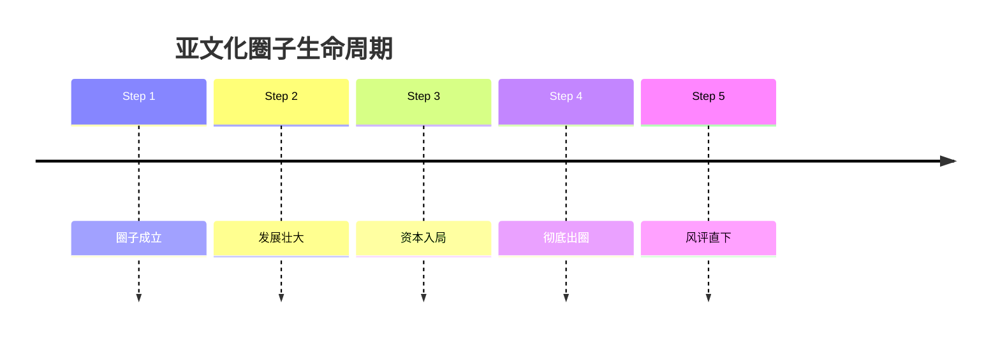
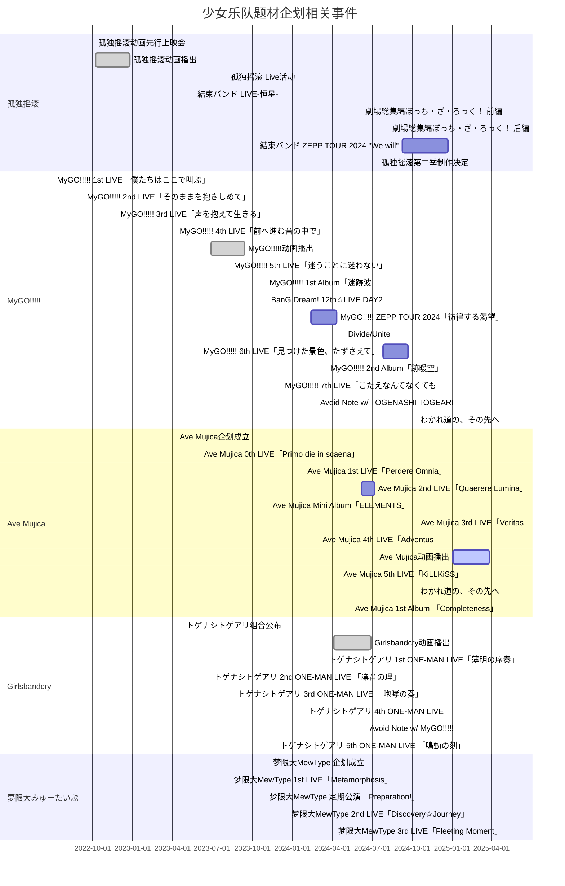

# 木柜子乐队相关内容

随着孤独摇滚等少女乐队的放送，日本动漫界逐渐掀起了少女乐队的风潮，甚至被人戏称为大少女乐队时代的来临。然而，这光鲜亮丽的表象下暗藏着亚文化社群内部的碰撞与冲突。由于乐队题材的风靡及大规模出圈，这一领域下的粉丝群体不断壮大，同时涌入了不少的逆天群体。

一般来说，一个亚文化圈子早晚都会经历上述五个过程，而少女乐队题材的番剧、企划除资本入局这一背景以外十分符合这一发展规律。

下方的甘特图展示了自从孤独摇滚动画播出后少女乐队企划、动画相关事件。

:::details 展开以查看详情，使用电脑端可获得最佳阅览体验

:::
注：红线为当前时间

从这张甘特图中可以看出，自2024年以来，少女乐队相关题材的企划活动举行地愈发频繁，从侧面反映出了当前少女乐队题材在国内外的受欢迎程度。因此对这种题材感到不满的人数众多的情况也就不足为奇了。

笔者看来，少女乐队题材的动画及企划凭借其独特的三次元真人乐队表演形式，以及剧集中出色的动画表现吸引了大部分的粉丝。但是不排除观众群体内存在不理性者的可能性。这一现象加速了网络上的对峙形式，甚至导致了路人对这一题材地图炮式的中伤与攻击。

笔者身边也有不少观看少女乐队题材的朋友，就以群聊内观看情况为例，下方表格呈现了他们的观看情况。

<table>
  <tr>
    <th colspan="6" align="center">🩹🐧🪨群内木柜子乐队番剧观看状况统计</th>
  </tr>
  <tr>
    <th>类型/番剧</th>
    <th>轻音少女</th>
    <th>孤独摇滚！</th>
    <th>Girls Band Cry</th>
    <th>BanG Dream It's Mygo!!!!!</th>
    <th>BanG Dream Ave Mujica</th>
  </tr>
  
  <tr align="center">
    <td>了解，但没有观看过</td>
    <td>星辰筑梦者5（猫娘） Silentnrtx</td>
    <td>星辰筑梦者2 星晨筑梦者4 Silentnrtx fyjh 星辰筑梦者本人（只是听说过） 肖肖老公</td>
    <td>liii 星晨筑梦者4</td>
    <td>星辰筑梦者5（猫娘） liii 星晨筑梦者4 minninverse_</td>
    <td>星晨筑梦者4</td>
  </tr>
  
  <tr align="center">
    <td>未观看但是热衷于讨论</td>
    <td>无</td>
    <td>liii</td>
    <td>无</td>
    <td>无</td>
    <td>无</td>
  </tr>
  
  <tr align="center">
    <td>观看过（包含全部观看和部分观看）</td>
    <td>无</td>
    <td>星辰筑梦者5（猫娘）（前三集） Silentnrtx（第一集）</td>
    <td>Lancer Silentnrtx（前四集）</td>
    <td>无</td>
    <td>无</td>
  </tr>
  
  <tr align="center">
    <td>观看过并且热衷于讨论</td>
    <td>无</td>
    <td>无</td>
    <td>无</td>
    <td>Lancer Silentnrtx</td>
    <td>星辰筑梦者5（猫娘） Lancer Silentnrtx</td>
  </tr>
  
  <tr align="center">
    <td>观看过但是拒不承认</td>
    <td>minninverse_</td>
    <td>minninverse_</td>
    <td>无</td>
    <td>无</td>
    <td>无</td>
  </tr>
  
  <tr>
    <td colspan="6" align="center">备注：BanG Dream 1~3季（含OVA）、BanG Dream! Morfonication、PICO等由于大概率没人看过故不计入统计范围；未标明观看集数者为全部观看或未知</td>
  </tr>
</table>