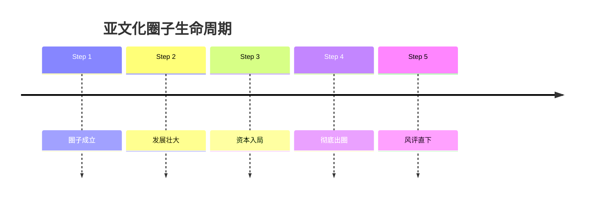
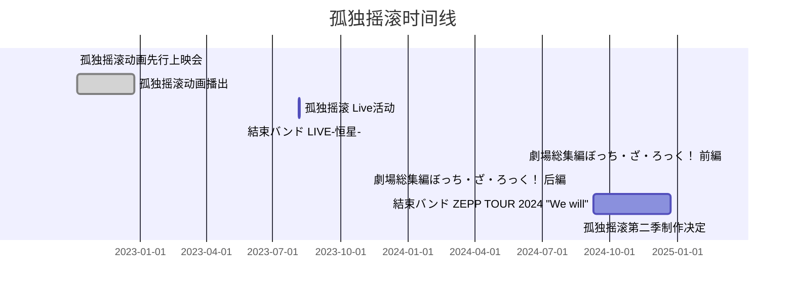
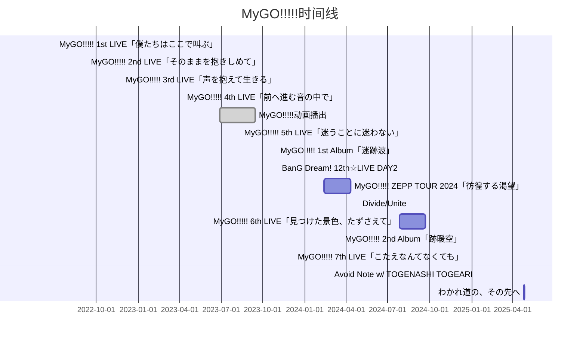
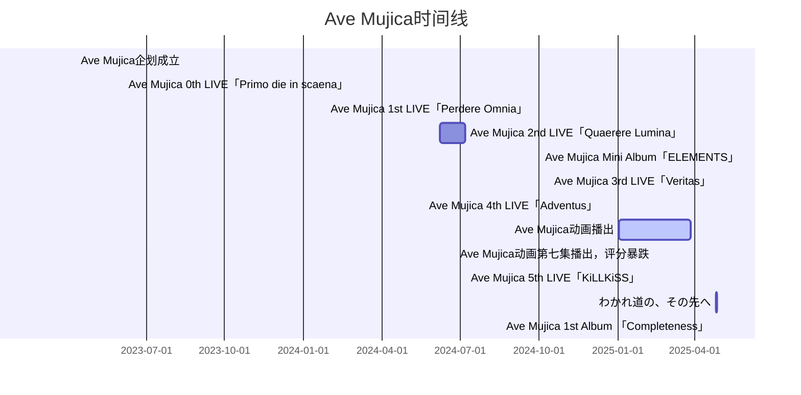
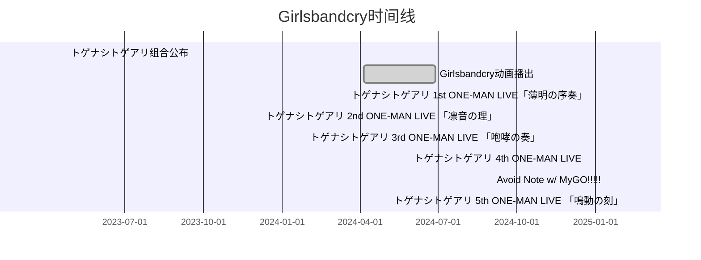
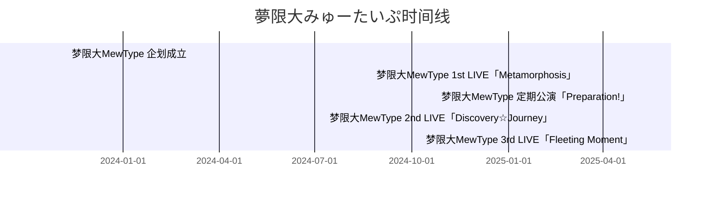

# 木柜子乐队相关内容

## 少女乐队企划社区风向论述

随着孤独摇滚等少女乐队的放送，日本动漫界逐渐掀起了少女乐队的风潮，甚至被人戏称为大少女乐队时代的来临。然而，这光鲜亮丽的表象下暗藏着亚文化社群内部的碰撞与冲突。由于乐队题材的风靡及大规模出圈，这一领域下的粉丝群体不断壮大，同时涌入了不少的逆天群体。

一般来说，一个亚文化圈子早晚都会经历上述五个过程，而少女乐队题材的番剧、企划除资本入局这一背景以外十分符合这一发展规律。

下方的甘特图展示了自从孤独摇滚动画播出后少女乐队企划、动画相关事件，鉴于篇幅所限，邦多利老团、D4DJ等企划calendar未列出。

:::details 展开以查看详情，使用电脑端可获得最佳阅览体验

:::
注：红线为当前时间

从这张甘特图中可以看出，自2024年以来，少女乐队相关题材的企划活动举行地愈发频繁，从侧面反映出了当前少女乐队题材在国内外的受欢迎程度。因此对这种题材感到不满的人数众多的情况也就不足为奇了。

笔者看来，少女乐队题材的动画及企划凭借其独特的三次元真人乐队表演形式，以及剧集中出色的动画表现吸引了大部分的粉丝。但是不排除观众群体内存在不理性者的可能性。这一现象加剧了网络上的对峙形式，甚至导致了路人对这一题材地图炮式的中伤与攻击。

笔者身边也有不少观看少女乐队题材的朋友，就以群聊内观看情况为例，下方表格呈现了他们的观看情况。

<table>
  <thead>
  <tr>
    <th colspan="6" align="center">🩹🐧🪨群内木柜子乐队番剧观看状况统计</th>
  </tr>
  </thead>
  <tbody>
  <tr>
    <th>类型/番剧</th>
    <th>轻音少女</th>
    <th>孤独摇滚！</th>
    <th>Girls Band Cry</th>
    <th>BanG Dream It's Mygo!!!!!</th>
    <th>BanG Dream Ave Mujica</th>
  </tr>
  
  <tr align="center">
    <td>了解，但没有观看过</td>
    <td>星辰筑梦者5（猫娘） Silentnrtx</td>
    <td>星辰筑梦者2 星晨筑梦者4 Silentnrtx fyjh 星辰筑梦者本人（只是听说过） 肖肖老公</td>
    <td>liii 星晨筑梦者4</td>
    <td>星辰筑梦者5（猫娘） liii 星晨筑梦者4 minninverse_</td>
    <td>星晨筑梦者4</td>
  </tr>
  
  <tr align="center">
    <td>未观看但是热衷于讨论</td>
    <td>无</td>
    <td>liii</td>
    <td>无</td>
    <td>无</td>
    <td>无</td>
  </tr>
  
  <tr align="center">
    <td>观看过（包含全部观看和部分观看）</td>
    <td>无</td>
    <td>星辰筑梦者5（猫娘）（前三集） Silentnrtx（第一集）</td>
    <td>Lancer Silentnrtx（前四集）</td>
    <td>无</td>
    <td>无</td>
  </tr>
  
  <tr align="center">
    <td>观看过并且热衷于讨论</td>
    <td>无</td>
    <td>无</td>
    <td>无</td>
    <td>Lancer Silentnrtx</td>
    <td>星辰筑梦者5（猫娘） Lancer Silentnrtx</td>
  </tr>
  
  <tr align="center">
    <td>观看过但是拒不承认</td>
    <td>minninverse_</td>
    <td>minninverse_</td>
    <td>无</td>
    <td>无</td>
    <td>无</td>
  </tr>
  
  <tr>
    <td colspan="6" align="center">备注：BanG Dream 1~3季（含OVA）、BanG Dream! Morfonication、PICO等由于大概率没人看过故不计入统计范围；未标明观看集数者为全部观看或未知</td>
  </tr>
  </tbody>
</table>

## 少女乐队企划如何变现

日本动漫游戏公司Bushiroad（7803/东证Growth ^[2022年四月，东京证券交易所将原有四个市场转移为"Prime""Standard""Growth"三个市场，分别对应为全球性企业、中等规模企业、新兴企业。东证Growth，是东京证券交易所的创业板市场，面向高成长性中小企业，上市门槛低于主板（Prime/Standard），但需满足持续增长潜力等要求。详见：<https://www.thepaper.cn/newsDetail_forward_17451806>、 <https://www.guancha.cn/internation/2020_12_28_576044.shtml>] ）2月14日盘后发布财报，2025财年第二财季（2024年7-12月）合并经常利润 ^[連結経常利益（合并经常利润）是反映企业集团整体经营活动的核心利润指标，包含主营业务利润、投资收益及财务费用等经常性收支，扣除所得税前的综合盈利能力。経常利益：企业的日常经营中每次活动经常重复地产生的利益。在损益表中，表示在营业利润上加上营业外收益，再扣除营业以外的费用。] 同比激增4.2倍至19.1亿日元。公司同步将全年（2024年7月-2025年6月 ^[日本企业财年通常为每年4月至次年3月，但部分公司采用非标准财年（如Bushiroad为7月至次年6月）。下方提及所有财年季度与公历纪年的转换为：2025财年Q1季度：2024年7月至9月，以此类推。] ）经常利润预测从20亿日元大幅上调50%至30亿日元，较上年度实际利润增幅预期由5.4%提升至58.1%。

据测算，受基数效应影响，2025年1-6月下半财年经常利润或将同比减少24.7%至10.8亿日元。值得注意的是，最新季度（2023年10-12月）实现19.2亿日元经常利润（去年同期亏损3亿日元），销售营业利润率[^first]由-2%显著回升至9%，反映核心业务盈利能力明显改善。^[ブシロード、今期経常を50％上方修正 [EB/OL]. Kabutan, \(2025-02-14\)[2025-03-15]. <https://kabutan.jp/news/?b=k202502140478>.]

[^first]: 売上営業損益率（销售营业利润率）是营业利润占销售收入的百分比，计算公式为：
    $$\text{销售营业利润率} = \frac{\text{营业利润}}{\text{销售收入}} \times 100\%$$
    用于衡量企业主营业务的盈利效率。

BanG Dream!（BanG Dream!／バンドリ！）是以女子乐队为主题，由Bushiroad制作的跨媒体企划。企划讲述女子高中生的乐队活动，拥有多个女子乐队组合，并以电视动画、手机音乐游戏、漫画、轻小说、广播、声优参与的现实演唱会和舞台活动等形式展开^[BanG Dream! - 萌娘百科_万物皆可萌的百科全书 [DB/OL]. 萌娘百科, \(2025-03-06\)[2025-03-14]. <https://mzh.moegirl.org.cn/BanG_Dream!>.]。

这类企划一般有以下几种盈利方式：

- 卡牌TCG业务（TCGユニット）
- 专辑CD、Blu-ray Live 录像、Live演出（ライブエンタメユニット）
- 内容板块（コンテンツユニット，手游等）
- 立牌、玩偶、手办等周边（MDユニット）

其中，TCG业务占Bushiroad业务净销售额的大头。

### TCG Unit 卡牌TCG板块

集换式卡牌游戏，简称TCG（Trading Card Game），武士道作为IP企划公司，最先由TCG业务起家，因此该单元的ordinary profit在武士道总营收占比高达50%左右。旗下有热门产品黑白双翼（Weiß Schwarz / ヴァイスシュヴァルツ），发行于2008年，内含来自各类公司旗下的各类IP，如SEGA、角川（KADOKAWA）、Key社，以及武士道原创企划。随着各类IP企划的推出，武士道也会贩卖相应的booster补充包。

2025财年Q2季度Bushiroad TCG板块销售收入为68.39亿日元，同比上涨21.46亿日元[^second]。

TCG业务评级：顺利。

[^second]: Bushiroad 2025年6月期第2四半期決算説明資料 [EB/OL]. Bushiroad, \(2025-03-06\)[2025-03-14]. <https://bushiroad.com/information/244>.

### Contents Unit 内容板块

武士道旗下有Bushiroad Games负责游戏开发运营，Bushiroad Works负责IP开发，手机游戏、主机游戏、书籍、电子书业务等。

BanG Dream! 少女乐团派对！原先由Craft Egg开发并运营，但由于Craft Egg解散并于2024年4月1日被其母公司Cyber Agent吸收合并，2023年12月18日，「BanG Dream! 少女乐团派对！」宣布运营体制变更，Craft Egg将于2024年1月4日退出开发运营团队，由Bushiroad继续运营^[Craft Egg - 萌娘百科_万物皆可萌的百科全书 [DB/OL]. 萌娘百科, \(2024-11-09\)[2025-03-14]. <https://mzh.moegirl.org.cn/Craft_Egg>. ]。

!!曾有传闻称Bushiroad在宣布有十三款游戏正在开发后股价暴跌。（来源请求）!!

2025财年Q2季度Bushiroad 内容板块板块销售收入为14.74亿日元，同比上涨0.54亿日元[^second]。

内容板块业务评级：疲软。

### Live & Entertainment Unit 演唱会及娱乐板块

作为MediaMix形式的综合性企划，BanG Dream！有七个乐队的声优能够现场演奏乐器并演唱，如Poppin'Party、Roselia等。这些乐队的声优会参与线下Live演出。

此外，Bushiroad旗下有Bushiroad Music负责Live、音乐Package、发行、舞台、面具音乐剧、音乐版权等业务。

2025财年Q2季度Bushiroad 内容板块板块销售收入为13.58亿日元，同比上涨1.58亿日元[^second]。

演唱会及娱乐板块业务评级：较顺利。

下图展示了2025财年Q3季度专辑KiLLKiSS发行、Q4季度乐队Ave Mujica将进行线下Live等事宜。

### MD UNIT 周边板块

财报中提及BanG Dream！相关周边在国内外市场销售情况均良好。

2025财年Q2季度Bushiroad MD板块销售收入为22.26亿日元，同比上涨10.23亿日元[^second]。

周边板块业务评级：顺利。

下图展示了LIVE场贩售卖等内容。此外，图中还提到2025财年Q4季度，Bushiroad将成立新景品周边品牌たいにぃぎふと。

### Appendix：ブシロードファン感謝ゴールデンウィーク

ブシロードファン感謝ゴールデンウィーク是为向国内外所有 Bushiroad 粉丝表示感谢而举办的活动。

## 关于MyGO的音乐

### MyGO!!!!! 1st album 「迷跡波」

2023年11月1日，MyGO!!!!! 1st album 「迷跡波」发行。标题衍生自日语“航跡波（こうせきは）”，意为航行物体划过静止流体表面时在尾部产生的波^[详见b站官方动态：https://t.bilibili.com/865276713153593368]。

<Meting mid="13464915417" type="playlist" api="https://api.injahow.cn/meting/?server=:server&type=:type&id=:id&auth=:auth&r=:r"/>

<table>
  <thead>
    <tr>
      <th>曲序</th>
      <th>曲目</th>
      <th>作词</th>
      <th>作曲</th>
      <th>编曲</th>
      <th>时长</th>
    </tr>
  </thead>
  <tbody>
    <tr><td>1</td><td>迷星叫</td><td>藤原優樹(SUPA LOVE)</td><td>長谷川大介(SUPA LOVE)</td><td>長谷川大介(SUPA LOVE)</td><td>3:31</td></tr>
    <tr><td>2</td><td>壱雫空</td><td>藤原優樹(SUPA LOVE)</td><td>hisakuni(SUPA LOVE)</td><td>hisakuni(SUPA LOVE)</td><td>3:12</td></tr>
    <tr><td>3</td><td>碧天伴走</td><td>藤原優樹(SUPA LOVE)</td><td>木下龍平(SUPA LOVE)</td><td>木下龍平(SUPA LOVE)</td><td>3:38</td></tr>
    <tr><td>4</td><td>影色舞</td><td>藤原優樹(SUPA LOVE)</td><td>木下龍平(SUPA LOVE)</td><td>木下龍平(SUPA LOVE)</td><td>3:30</td></tr>
    <tr><td>5</td><td>歌いましょう鳴らしましょう</td><td>メガテラ・ゼロ</td><td>メガテラ・ゼロ</td><td>Mr.FanTastiC</td><td>2:58</td></tr>
    <tr><td>6</td><td>潜在表明</td><td>藤原優樹(SUPA LOVE)</td><td>鈴木裕明(SUPA LOVE)</td><td>鈴木裕明(SUPA LOVE)</td><td>4:23</td></tr>
    <tr><td>7</td><td>音一会</td><td>藤原優樹(SUPA LOVE)</td><td>尾崎豪(SUPA LOVE)</td><td>尾崎豪(SUPA LOVE)</td><td>4:43</td></tr>
    <tr><td>8</td><td>春日影(MyGO!!!!! ver.)</td><td>織田あすか(Elements Garden)</td><td>藤田淳平(Elements Garden)</td><td>藤田淳平(Elements Garden)</td><td>4:18</td></tr>
    <tr><td>9</td><td>詩超絆</td><td>藤原優樹(SUPA LOVE)</td><td>橫地健太(SUPA LOVE)</td><td>橫地健太(SUPA LOVE)</td><td>3:58</td></tr>
    <tr><td>10</td><td>迷路日々</td><td>藤原優樹(SUPA LOVE)</td><td>松坂康司(SUPA LOVE)</td><td>松坂康司(SUPA LOVE)</td><td>3:37</td></tr>
    <tr><td>11</td><td>無路矢</td><td>藤原優樹(SUPA LOVE)</td><td>庄司夏葵(SUPA LOVE)</td><td>庄司夏葵(SUPA LOVE)</td><td>3:42</td></tr>
    <tr><td>12</td><td>名無声</td><td>藤原優樹(SUPA LOVE)</td><td>金崎真士(SUPA LOVE)</td><td>金崎真士(SUPA LOVE)</td><td>4:31</td></tr>
    <tr><td>13</td><td>栞</td><td>織田あすか(Elements Garden)</td><td>藤田淳平(Elements Garden)</td><td>藤田淳平(Elements Garden)</td><td>4:28</td></tr>
  </tbody>
</table>

值得注意的是，这张专辑中的曲名存在相当多的借字现象。

日语中的借字有两种用法：一种是取读音（主要指的是音读 ^[训读是日语固有发音，按汉字含义对应和语词，如「山→やま」；音读模仿古汉语发音，多用于复合词，如「火山→かざん」。训读表意，音读表音，两者常混合使用。]）相同或相近的汉字来对假名进行表记，而常常不考虑其原本的字义。另一种是取含义相同或相关的汉字来对假名进行标记，而通常不考虑其原本的读音（主要指的是训读）。通常所说的借字（狭义的借字），一般是指前者。对于后者的情况，一般会称为“义训”（日语：義訓） ^[借字 - 萌娘百科_万物皆可萌的百科全书 [DB/OL]. 萌娘百科, \(2024-12-15\)[2025-03-30]. <https://mzh.moegirl.org.cn/%E5%80%9F%E5%AD%97>.]。

笔者在这里举一些例子进行说明：

**Tr.01 迷星叫**：MyGO!!!!! 动画第十二集正式成团后的Live演奏曲，也是乐队的第一首原创曲，同音借字自「迷い歌」，即迷惘之歌。

**Tr.02 壱雫空**：MyGO!!!!! 动画OP，同时游戏内谱面（SP难度）为第六届GBP杯决赛团队赛的第一首课题曲。标题为日语“一滴”的同音借字，读音由“壱”（ひとつ，训读；“壹”的日本简化字，Unicode U+58F1 Shift_JIS-2004 88EB）、“雫”（しずく，训读；和制汉字，雨水滴落之意，Unicode U+96EB Shift_JIS-2004 8EB4）和“空（くう）”（音读）拆分重组而成。

**Tr.10 迷路日々**: MyGO!!!!! 动画十二集插曲，标题读音同melody，意为旋律、曲调，由“迷（めい）”（音读）、“路（ろ）”（音读），以及将“日”的英译“デイ”（day）中的“イ”改为小写假名“ィ”后重组而成。

除此之外，我们可以发现本专辑第五曲「歌いましょう鳴らしましょう」由producerメガテラ・ゼロ制作。该制作人于2011年开始于niconico发表翻唱作品，并于2021年开始VOCALOID相关制作。他曾为BanG Dream! 旗下虚拟歌手企划夢ノ結唱提供曲目《Be born》。这首曲目的吉他、贝斯等的演奏^[Guitar：つっくん、Bass：つっくん、Drums：ふじゃん]由其在2016年组建的乐队Mr.FanTastiC内成员负责。

### MyGO!!!!! 2st album 「跡暖空」

跡暖空（みちのく）是《BanG Dream!》企划组合MyGO!!!!!的第二张专辑，发售于2024年12月18日。分为Blu-ray付生产限定A、B两盘以及通常盘三种规格。

<Meting mid="13251480603" type="playlist" api="https://api.injahow.cn/meting/?server=:server&type=:type&id=:id&auth=:auth&r=:r"/>

| 曲序 | 曲目                     | 作词                       | 作曲                       | 编曲                     | 时长   |
|------|--------------------------|---------------------------|---------------------------|-------------------------|--------|
| 1    | 歩拾道                   | 藤原優樹(SUPA LOVE)       | 庄司夏葵(SUPA LOVE)       | 庄司夏葵(SUPA LOVE)     | 4:20   |
| 2    | 明弦音                   | 藤原優樹(SUPA LOVE)       | 鈴木裕明(SUPA LOVE)       | 鈴木裕明(SUPA LOVE)     | 4:03   |
| 3    | 孤壊牢                   | 藤原優樹(SUPA LOVE)       | 木下龍平(SUPA LOVE)       | 木下龍平(SUPA LOVE)     | 3:34   |
| 4    | 霧周途                   | 藤原優樹(SUPA LOVE)       | 藤田淳平(Elements Garden) | 藤田淳平(Elements Garden)| 3:42   |
| 5    | 端程山                   | 藤原優樹(SUPA LOVE)       | トミタカズキ(SUPA LOVE)   | トミタカズキ(SUPA LOVE) | 4:20   |
| 6    | 処救生                   | 藤原優樹(SUPA LOVE)       | 松坂康司(SUPA LOVE)       | 松坂康司(SUPA LOVE)     | 3:37   |
| 7    | 輪符雨                   | 藤原優樹(SUPA LOVE)       | 木下龍平(SUPA LOVE)       | 木下龍平(SUPA LOVE)     | 3:27   |
| 8    | 夜隠染                   | 藤原優樹(SUPA LOVE)       | 鈴木裕明(SUPA LOVE)       | 鈴木裕明(SUPA LOVE)     | 3:20   |
| 9    | 過惰幻                   | 藤原優樹(SUPA LOVE)       | hisakuni(SUPA LOVE)       | hisakuni(SUPA LOVE)     | 3:57   |
| 10   | 回層浮                   | 藤原優樹(SUPA LOVE)       | hisakuni(SUPA LOVE)       | hisakuni(SUPA LOVE)     | 4:21   |
| 11   | 砂寸奏                   | 藤原優樹(SUPA LOVE)       | 槇島隆人(SUPA LOVE)       | 槇島隆人(SUPA LOVE)     | 3:43   |
| 12   | 焚音打                   | 藤原優樹(SUPA LOVE)       | 長谷川大介(SUPA LOVE)     | 長谷川大介(SUPA LOVE)   | 4:06   |
